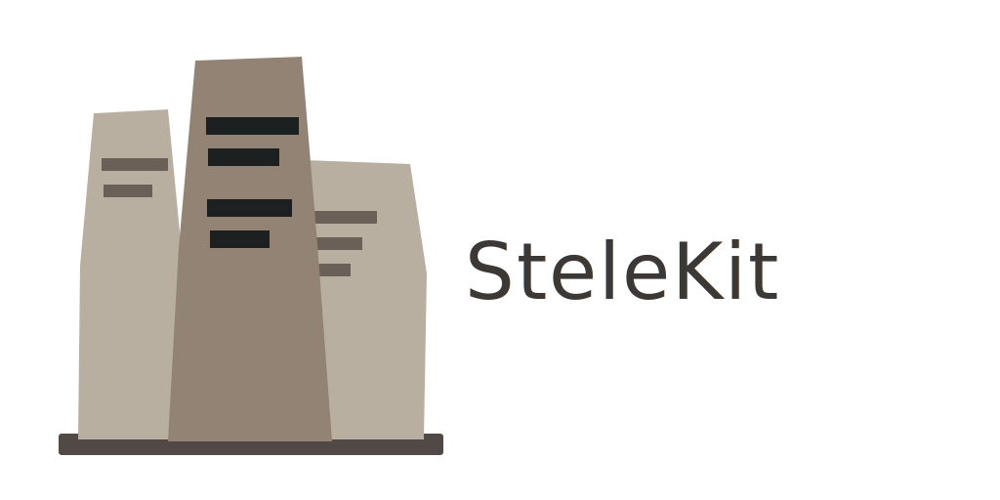

<p align="center">
  
</p>

<p align="center"><em>Your knowledge, carved in stone.</em></p>

A local-first outliner that keeps your notes as plain markdown on your disk — forever — and runs natively on every platform you use.

[](LICENSE)
[](https://kotlinlang.org)
[](https://www.jetbrains.com/lp/compose-multiplatform/)

---

## What is SteleKit

SteleKit is an outliner-first personal knowledge management system. You write in blocks, link pages bidirectionally, and journal daily — all in plain markdown files on your disk. There is no sync service, no proprietary format, no company that can take your notes away. The files are yours.

Logseq pioneered this model and built a community around it. SteleKit makes different technical bets: Kotlin Multiplatform instead of Electron, persistent SQLite instead of in-memory re-scan, Compose Multiplatform instead of a web renderer wrapped in a desktop shell. The result is a native feel on every target — including Android, where the original is genuinely compromised.

SteleKit exists because of Logseq's ideas, not in spite of them. Your existing Logseq graph opens in SteleKit without migration. The markdown files are unchanged.

### How they differ

|  | Logseq | SteleKit |
|--|--------|----------|
| Runtime | Electron / ClojureScript | Kotlin Multiplatform / Compose |
| Mobile | Compromised | Native-first |
| Graph storage | In-memory re-scan on launch | Persistent SQLite — instant open |
| Business model | Cloud sync (paid) | Source-available, free to use |
| Plugin system | JS plugins | Kotlin-native (early-stage) |
| Long-term bet | Platform + hosted services | Local-first, always |

---

## Why I built this

I've been a Logseq user for years. The outliner-first, block-based approach shaped by Zettelkasten — as laid out in *How to Take Smart Notes* and *How to Read a Book* — is central to how I think about notes. Obsidian is excellent software, but it treats notes as flat documents. That missing outliner layer is not a minor UX preference for me; it changes how ideas connect.

The problem was Logseq's Android app. Over time it got slower, and the team's attention moved toward hosted sync and collaborative editing — reasonable bets for a business, wrong bets for my workflow. I work offline. I don't want a server. I just want a fast, reliable editor on every device I own.

At the same time, I'd watched Kotlin Multiplatform mature into the clearest answer to "write once, run natively everywhere." The developer tooling gap between KMP and ClojureScript is not subtle. Type safety, incremental compilation, first-class IDE support, native rendering via Compose — none of that is available in the Electron/CLJS stack. I wanted a foundation I could maintain and build on without fighting the toolchain.

SteleKit is the editor I wanted to exist. It reads your existing Logseq markdown without migration, runs natively on the platforms I care about (Desktop and Android, primarily), and stores the graph in persistent SQLite so opening a large graph is instant rather than a cold-scan. The sync story is a git repo with an auto-committing cron job — not glamorous, but it works everywhere and costs nothing.

---

## SteleKit is not for you if…

- **You're happy with Logseq or Obsidian.** Both are great projects with active teams, large plugin ecosystems, and paying users funding their development. If they're working for you, please keep using them and support the developers.
- **You rely on Logseq's hosted sync or multiplayer editing.** SteleKit has no sync service and no plans for one. You manage your own files.
- **You're primarily on Windows or iOS.** Desktop (JVM) and Android are the focus. Windows works but gets less attention. iOS is planned but not there yet.
- **You need a mature plugin ecosystem today.** The plugin scaffolding exists but it's early-stage.
- **You don't want to run software built by one person in their spare time.** That's a completely fair reason.

---

## Acknowledgements

SteleKit stands on the shoulders of several projects and their communities:

- **[Logseq](https://logseq.com)** — the original inspiration. The block-based, bidirectional-linking, local-first model is Logseq's vision. SteleKit exists because that vision is right.
- **[Obsidian](https://obsidian.md)** — for proving that a local-first, file-based knowledge tool can be polished, fast, and sustainable as a business.
- **[Roam Research](https://roamresearch.com)** — for popularising the outliner-as-knowledge-graph idea and proving people would pay for it.
- **[Athens Research](https://github.com/athensresearch/athens)** — an open-source Roam alternative that explored similar technical territory before shutting down. Its existence showed the problem was worth solving.
- **[JetBrains](https://www.jetbrains.com)** — for Kotlin, Compose Multiplatform, and SQLDelight (via Cash App). The KMP ecosystem made this project feasible.
- **Niklas Luhmann** — for the Zettelkasten method, and Sönke Ahrens (*How to Take Smart Notes*) for explaining why it works.

---

<!-- BEGIN_INSTALL -->
## Install

**Homebrew (macOS and Linux):**
```bash
brew tap tstapler/stelekit https://github.com/tstapler/stelekit
brew install tstapler/stelekit/stelekit
```

**Linux AppImage** (works on any distro — recommended if unsure):
```bash
chmod +x SteleKit-*.AppImage
./SteleKit-*.AppImage
```

If the app fails to start, try `APPIMAGE_EXTRACT_AND_RUN=1 ./SteleKit-*.AppImage`.

**Debian/Ubuntu:** `sudo dpkg -i SteleKit-*.deb`

**Fedora/openSUSE:** `sudo rpm -i SteleKit-*.rpm`

**Windows:** run `SteleKit-*.msi` from the [latest release](https://github.com/tstapler/stelekit/releases/latest).

**Android — F-Droid** (recommended — automatic updates):
1. Install [F-Droid](https://f-droid.org/)
2. Settings → Repositories → **+** → enter:
   ```
   https://tstapler.github.io/stelekit/fdroid/repo
   ```
3. Search for **SteleKit** and install.

**Android — direct APK:** download `SteleKit-*-android.apk` from the [latest release](https://github.com/tstapler/stelekit/releases/latest). Enable *Install from unknown sources* first.
<!-- END_INSTALL -->

---

## Build from Source

```bash
git clone https://github.com/tstapler/stelekit
cd stelekit
./gradlew :kmp:runApp
```

Point it at your existing Logseq graph directory. It reads the same markdown files.

**Prerequisites:** JDK 17+. Android SDK required for Android builds. Xcode required for iOS (macOS only).

---

## Architecture

SteleKit is a single Kotlin Multiplatform project. Shared business logic, data layer, and Compose UI live in `kmp/src/commonMain`. Platform-specific wiring is minimal.

| Layer | Technology |
|-------|------------|
| UI | Compose Multiplatform — one shared UI for all targets |
| Data | SQLDelight + SQLite — persistent, reactive, no cold-start re-scan |
| File format | Logseq-compatible markdown — your files are never locked in |
| Parsing | Custom Kotlin Markdown + Org-mode parser |
| Sync (roadmap) | CRDT-based, binary-compatible with Logseq sync format |

### Platform targets

| Platform | Status | Notes |
|----------|--------|-------|
| Desktop (JVM) | Working | Primary development target |
| Android | Working | Native Compose, SQLDelight persistent |
| Web (JS) | Working | SQLDelight web-worker driver + SQL.js |
| iOS | Planned | Disabled — Ivy repository issues |

---

## Project Status

The core loop — open a graph, read and write blocks, navigate pages, search, follow backlinks — works on Desktop and Android. The parser handles real-world Logseq graphs.

What's missing or early-stage:
- **Advanced queries** — no Datalog engine yet; basic full-text search via SQLite FTS5
- **Whiteboards** — not implemented
- **Plugin system** — scaffolding only
- **iOS** — disabled, build issues under investigation

See [`TODO.md`](TODO.md) for the full roadmap and known issues.

---

## Contributing

SteleKit is source-available under the [Elastic License 2.0](LICENSE). You can use it freely — including commercially — but you cannot fork it and sell it as a competing product.

Contributions are welcome, especially from Kotlin Multiplatform and Compose developers. Good places to start:

- Feature parity gaps (see [`docs/tasks/`](docs/tasks/))
- Test coverage on edge cases in the parser and outliner
- Android and iOS platform polish

---

## GitHub Topics

`kotlin-multiplatform` · `logseq` · `pkm` · `zettelkasten` · `compose-multiplatform` · `sqldelight` · `outliner` · `knowledge-management` · `local-first` · `note-taking` · `android` · `desktop`
