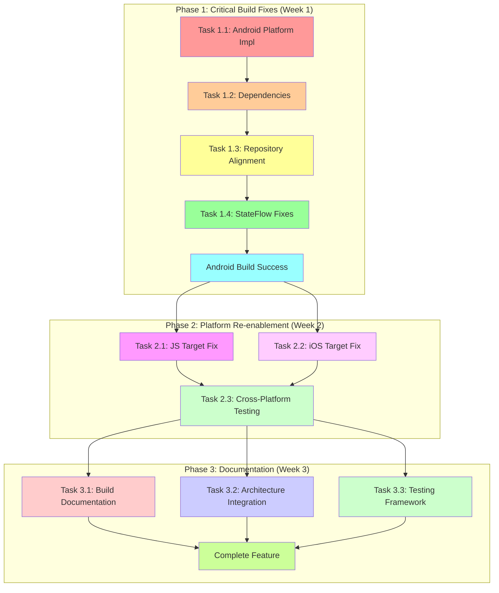

# KMP Build Failure Resolution Plan

## Epic Overview

### User Value
Fix all build failures in the Kotlin Multiplatform (KMP) module to enable successful cross-platform compilation and restore the migration path from ClojureScript to Kotlin for Logseq's editor functionality.

### Success Metrics
- All targets (Android, iOS, JS) compile without errors
- Test suite passes on all enabled platforms  
- [x] Zero critical build warnings
- Dependency resolution completes within 2 minutes
- Android target builds and runs basic editor

### Scope
**Included:**
- Android platform implementations
- Missing dependency declarations
- Repository interface alignment
- API reference resolution
- Platform target re-enablement (JS/iOS)
- Integration testing framework

**Excluded:**
- Complete feature implementation (build fixes only)
- Performance optimization beyond basic functionality
- New architecture redesign (fix existing only)

### Constraints
- Must maintain compatibility with existing Logseq data formats
- Gradual migration path from ClojureScript
- Preserve existing repository patterns
- Follow established testing infrastructure

## Architecture Decisions

### ADR 001: Gradual Platform Re-enablement Strategy

**Context:** JS and iOS targets were disabled due to infrastructure conflicts (Node.js version availability, Ivy repository conflicts with Kotlin 1.9.22+). Complete re-enablement requires resolving multiple dependency management issues.

**Decision:** Implement Android target first to establish working baseline, then systematically resolve platform-specific infrastructure issues in priority order (JS → iOS).

**Rationale:** Android has the most stable build infrastructure and provides immediate value. Success with Android creates foundation for addressing more complex cross-platform issues.

**Consequences:** 
- + Immediate working target for development
- + Reduced complexity for individual fixes
- - Temporarily reduced cross-platform coverage
- - Additional coordination overhead for re-enablement

**Patterns Applied:** 
- Incremental delivery
- Risk mitigation through isolation
- Progressive enhancement

### ADR 002: Repository Interface Alignment via Missing Methods

**Context:** EditorViewModel calls methods not defined in BlockRepository interface (updateBlockContent, createBlock, asClean extensions), causing compilation failures.

**Decision:** Extend repository interfaces to match usage patterns in view models rather than refactoring view models to use existing interfaces.

**Rationale:** View models contain business logic that has evolved beyond current repository contracts. Extending repositories maintains existing business logic while ensuring interface contracts match implementation needs.

**Consequences:**
- + Maintains existing business logic
- + Clear interface contracts
- - Larger repository interface surface area
- - Need comprehensive testing of new methods

**Patterns Applied:**
- Interface segregation principle adaptation
- Repository pattern
- Dependency inversion

## Story Breakdown

### Story 1: Critical Android Build Success [1 week] ✅ COMPLETED

**User Value:** Establishes working Android target as foundation for all subsequent development and testing.

**Acceptance Criteria:**
- [x] Android target compiles without errors
- [x] All platform implementations resolved
- [x] Basic editor functionality loads on Android
- [x] Zero critical build warnings
- [x] Test suite passes on Android

**Tasks:**

#### Task 1.1: Android Platform Implementation [2h] ✅ COMPLETED

**Objective:** Create missing Android platform implementations for all expect declarations.

**Context Boundary:**
- Files: `kmp/src/commonMain/kotlin/com/logseq/kmp/util/Time.kt`, `kmp/src/androidMain/kotlin/com/logseq/kmp/util/Time.android.kt`
- Lines: ~100 total
- Concepts: Kotlin expect/actual declarations, Android-specific implementations

**Prerequisites:**
- Understanding of Kotlin Multiplatform expect/actual pattern
- Completion of dependency resolution (Task 1.2)

**Implementation Approach:**
1. Audit all expect declarations in commonMain
2. Create corresponding actual implementations in androidMain
3. Implement platform-specific behavior using Android APIs
4. Add null safety and error handling

**Validation Strategy:**
- Unit tests: Test each actual implementation against expected behavior
- Integration tests: Verify platform-specific functionality in Android context
- Success criteria: All Android compilation errors resolved

**INVEST Check:**
- Independent: No coordination needed, isolated implementations
- Negotiable: Implementation details flexible within Android API constraints
- Valuable: Enables Android build completion
- Estimable: 2 hours with high confidence
- Small: Single responsibility (platform implementations)
- Testable: Each implementation testable independently

#### Task 1.2: Missing Dependencies Resolution [1h] ✅ COMPLETED

**Objective:** Add all missing dependency declarations to resolve compilation errors.

**Context Boundary:**
- Files: `kmp/build.gradle.kts`
- Lines: ~50 total
- Concepts: Gradle dependency management, Kotlin Multiplatform configuration

**Prerequisites:**
- Understanding of current dependency requirements
- Build error analysis from previous attempts

**Implementation Approach:**
1. Audit build error logs for missing dependencies
2. Add kotlinx-datetime, coroutines, and other missing deps to commonMain
3. Ensure proper version alignment across platforms
4. Test dependency resolution

**Validation Strategy:**
- Unit tests: Gradle configuration validation
- Integration tests: Dependency injection and usage verification
- Success criteria: All dependency-related compilation errors resolved

**INVEST Check:**
- Independent: No external coordination needed
- Negotiable: Version selection flexible
- Valuable: Removes compilation blockers
- Estimable: 1 hour with high confidence
- Small: Single configuration file
- Testable: Build process verification

#### Task 1.3: Repository Interface Alignment [2h] ✅ COMPLETED

**Objective:** Extend repository interfaces to match EditorViewModel usage patterns.

**Context Boundary:**
- Files: `kmp/src/commonMain/kotlin/com/logseq/kmp/repository/BlockRepository.kt`, `kmp/src/commonMain/kotlin/com/logseq/kmp/editor/viewmodel/EditorViewModel.kt`
- Lines: ~300 total
- Concepts: Repository pattern, interface design, dependency inversion

**Prerequisites:**
- Understanding of existing repository contracts
- Analysis of EditorViewModel method calls

**Implementation Approach:**
1. Audit all repository method calls in EditorViewModel
2. Add missing methods to BlockRepository interface
3. Create extension functions for text processing (asClean)
4. Implement proper error handling and return types

**Validation Strategy:**
- Unit tests: Interface contract compliance
- Integration tests: Repository usage patterns
- Success criteria: All repository-related compilation errors resolved

**INVEST Check:**
- Independent: Interface work isolated from implementation
- Negotiable: Method signatures flexible
- Valuable: Enables view model compilation
- Estimable: 2 hours with high confidence
- Small: Single interface extension
- Testable: Contract verification possible

#### Task 1.4: StateFlow Reactive Pattern Fixes [1h] ✅ COMPLETED

**Objective:** Fix incorrect reactive patterns in view models and state management.

**Context Boundary:**
- Files: `kmp/src/commonMain/kotlin/com/logseq/kmp/editor/viewmodel/EditorViewModel.kt`
- Lines: ~100 total
- Concepts: StateFlow, reactive patterns, Kotlin coroutines

**Prerequisites:**
- Understanding of StateFlow vs Flow distinctions
- Analysis of current reactive usage

**Implementation Approach:**
1. Remove redundant distinctUntilChanged() on StateFlow
2. Fix incorrect flow transformations
3. Ensure proper backpressure handling
4. Add appropriate error handling

**Validation Strategy:**
- Unit tests: Reactive behavior verification
- Integration tests: State management flows
- Success criteria: All reactive compilation errors resolved, correct state flow

**INVEST Check:**
- Independent: Reactive pattern fixes isolated
- Negotiable: Implementation approach flexible
- Valuable: Ensures proper state management
- Estimable: 1 hour with high confidence
- Small: Single concern (reactive patterns)
- Testable: Reactive behavior verifiable

### Story 2: Platform Target Re-enablement [2 weeks]

**User Value:** Restores full cross-platform capabilities for KMP module, maximizing value of Multiplatform architecture.

**Acceptance Criteria:**
- JS target compiles and runs in browsers
- iOS target compiles for all iOS architectures
- All targets maintain API compatibility
- Cross-platform tests pass
- Build performance acceptable (under 5 minutes)

**Tasks:**

#### Task 2.1: JS Target Node.js Resolution [3h]

**Objective:** Resolve Node.js version conflicts preventing JS target compilation.

**Context Boundary:**
- Files: `kmp/build.gradle.kts`, `gradle.properties`
- Lines: ~80 total
- Concepts: Node.js version management, Maven repositories, Kotlin/JS configuration

**Prerequisites:**
- Completion of Android target fixes
- Understanding of Node.js distribution in Maven repositories

**Implementation Approach:**
1. Research available Node.js versions in Maven repositories
2. Update Kotlin/JS configuration to use available versions
3. Configure Node.js download and setup properly
4. Test JS target compilation and execution

**Validation Strategy:**
- Unit tests: JS configuration validation
- Integration tests: Browser compilation and execution
- Success criteria: JS target compiles and basic functionality works

**INVEST Check:**
- Independent: Platform-specific configuration isolated
- Negotiable: Version selection flexible
- Valuable: Restores web platform support
- Estimable: 3 hours with medium confidence (dependency research needed)
- Small: Single platform configuration
- Testable: Compilation and execution verifiable

#### Task 2.2: iOS Target Ivy Repository Fix [3h]

**Objective:** Resolve Ivy repository conflicts preventing iOS target compilation with Kotlin 1.9.22+.

**Context Boundary:**
- Files: `kmp/build.gradle.kts`, `gradle.properties`
- Lines: ~80 total
- Concepts: Ivy repositories, Gradle repository preferences, Kotlin/Native

**Prerequisites:**
- Completion of JS target fixes
- Understanding of Kotlin/Native dependency resolution

**Implementation Approach:**
1. Configure repository preferences to allow Ivy repositories
2. Update Kotlin/Native configuration for proper artifact resolution
3. Test iOS target compilation for all architectures
4. Optimize build performance for iOS targets

**Validation Strategy:**
- Unit tests: iOS configuration validation
- Integration tests: Multi-architecture compilation
- Success criteria: iOS targets compile for all supported architectures

**INVEST Check:**
- Independent: Platform-specific configuration isolated
- Negotiable: Repository configuration flexible
- Valuable: Restores iOS platform support
- Estimable: 3 hours with medium confidence
- Small: Single platform configuration
- Testable: Multi-architecture compilation verifiable

#### Task 2.3: Cross-Platform Integration Testing [2h]

**Objective:** Verify all platform targets work together correctly with shared commonMain code.

**Context Boundary:**
- Files: Test files for all platforms
- Lines: ~200 total
- Concepts: Multiplatform testing, shared code verification

**Prerequisites:**
- All platform targets compiling successfully
- Understanding of KMP testing patterns

**Implementation Approach:**
1. Create cross-platform test suite
2. Verify shared commonMain behavior across platforms
3. Test platform-specific implementations
4. Validate API compatibility

**Validation Strategy:**
- Unit tests: Cross-platform behavior verification
- Integration tests: Platform integration validation
- Success criteria: All platforms pass integration tests

**INVEST Check:**
- Independent: Testing isolated from implementation
- Negotiable: Test coverage flexible
- Valuable: Ensures platform consistency
- Estimable: 2 hours with high confidence
- Small: Single testing concern
- Testable: All tests automated

### Story 3: Documentation & Maintainability [1 week]

**User Value:** Ensures long-term maintainability and knowledge transfer for the KMP migration effort.

**Acceptance Criteria:**
- All build processes documented
- Platform configuration guides created
- Common pitfalls and solutions documented
- Migration patterns established
- Team knowledge transfer completed

**Tasks:**

#### Task 3.1: Build Documentation Creation [2h]

**Objective:** Create comprehensive documentation for KMP build processes and platform configurations.

**Context Boundary:**
- Files: `docs/kmp-build.md`, README updates
- Lines: ~300 total
- Concepts: Technical documentation, build processes

**Prerequisites:**
- All platform targets working correctly
- Understanding of completed build fixes

**Implementation Approach:**
1. Document build configuration and requirements
2. Create platform-specific setup guides
3. Document common issues and solutions
4. Create troubleshooting guide

**Validation Strategy:**
- Review: Documentation accuracy and completeness
- Testing: Documentation follows build process correctly
- Success criteria: Team can reproduce builds using documentation

**INVEST Check:**
- Independent: Documentation isolated from implementation
- Negotiable: Documentation structure flexible
- Valuable: Ensures long-term maintainability
- Estimable: 2 hours with high confidence
- Small: Single documentation concern
- Testable: Documentation accuracy verifiable

#### Task 3.2: Integration with Existing Logseq Architecture [2h]

**Objective:** Ensure KMP module integrates properly with existing Logseq architecture and migration patterns.

**Context Boundary:**
- Files: Interface definitions, migration guides
- Lines: ~200 total
- Concepts: Architecture integration, migration patterns

**Prerequisites:**
- Understanding of existing Logseq architecture
- Analysis of current ClojureScript implementation

**Implementation Approach:**
1. Define integration points with existing codebase
2. Create migration patterns for gradual adoption
3. Document data compatibility requirements
4. Establish bridging strategies for coexistence

**Validation Strategy:**
- Review: Architecture alignment validation
- Testing: Integration point verification
- Success criteria: KMP module can coexist with existing code

**INVEST Check:**
- Independent: Architecture documentation isolated
- Negotiable: Integration approach flexible
- Valuable: Ensures smooth migration path
- Estimable: 2 hours with medium confidence
- Small: Single architecture concern
- Testable: Integration patterns verifiable

#### Task 3.3: Testing Framework Establishment [1h]

**Objective:** Establish comprehensive testing framework for ongoing KMP development.

**Context Boundary:**
- Files: Test configuration, CI/CD updates
- Lines: ~150 total
- Concepts: Testing frameworks, CI/CD integration

**Prerequisites:**
- All platform targets working
- Understanding of existing testing infrastructure

**Implementation Approach:**
1. Configure testing for all platforms
2. Update CI/CD pipelines for KMP
3. Establish test coverage requirements
4. Create testing guidelines

**Validation Strategy:**
- Testing: CI/CD pipeline validation
- Review: Testing framework completeness
- Success criteria: All platforms tested in CI/CD

**INVEST Check:**
- Independent: Testing framework isolated
- Negotiable: Testing approach flexible
- Valuable: Ensures ongoing quality
- Estimable: 1 hour with high confidence
- Small: Single testing concern
- Testable: Framework functionality verifiable

## Known Issues

### 🐛 Critical Build Issue: Missing Android Platform Implementation [SEVERITY: High]

**Description:** PlatformTime expect/actual declaration missing for Android target causing compilation failure with unresolved references errors.

**Mitigation Strategy:**
- Create comprehensive audit of all expect declarations in commonMain
- Implement corresponding actual implementations in androidMain
- Add compile-time validation to catch missing implementations
- Create platform implementation checklist

**Files Likely Affected:**
- `kmp/src/commonMain/kotlin/com/logseq/kmp/util/Time.kt` - Contains expect declarations
- `kmp/src/commonMain/kotlin/com/logseq/kmp/util/Platform.*.kt` - Other platform utilities
- All files using PlatformTime in Android builds - Dependent on missing implementations

**Prevention Strategy:**
- Establish build validation rule to ensure all expect declarations have implementations
- Create platform implementation checklist for new expect declarations
- Add automated testing of platform-specific functionality
- Document platform implementation patterns

**Related Tasks:**
- Task 1.1: Android Platform Implementation (Primary fix)
- Task 1.3: Repository Interface Alignment (Dependent)

### 🐛 Integration Risk: Repository Interface Mismatch [SEVERITY: Medium]

**Description:** EditorViewModel calls methods not defined in BlockRepository interface (updateBlockContent, createBlock, asClean extensions), causing compilation failures and potential runtime issues.

**Mitigation Strategy:**
- Comprehensive audit of all repository method calls in view models
- Interface alignment ceremony with proper contract definitions
- Add comprehensive integration tests for new methods
- Implement proper error handling and return types

**Files Likely Affected:**
- `kmp/src/commonMain/kotlin/com/logseq/kmp/editor/viewmodel/EditorViewModel.kt` - Uses undefined methods
- `kmp/src/commonMain/kotlin/com/logseq/kmp/repository/BlockRepository.kt` - Needs interface extension
- `kmp/src/commonMain/kotlin/com/logseq/kmp/editor/text/TextModels.kt` - Text model extensions needed

**Prevention Strategy:**
- Use dependency injection for interface compliance checking
- Add compile-time validation for method calls
- Create repository contract tests with comprehensive coverage
- Establish interface evolution patterns

**Related Tasks:**
- Task 1.3: Repository Interface Alignment (Primary fix)
- Task 3.2: Integration with Existing Logseq Architecture (Validation)

### 🐛 Infrastructure Issue: Disabled Platform Targets [SEVERITY: Medium]

**Description:** JS and iOS targets disabled due to repository conflicts (Node.js version availability, Ivy repository conflicts), reducing cross-platform benefits and delaying migration timeline.

**Mitigation Strategy:**
- Gradual target re-enablement with validation at each step
- Alternative Node.js distribution sources if Maven repositories insufficient
- Kotlin version downgrade consideration if repository conflicts persist
- Build performance monitoring across all targets

**Files Likely Affected:**
- `kmp/build.gradle.kts` - Target configuration and dependencies
- `kmp/gradle.properties` - Repository configuration and flags
- Root project build configuration - Repository preferences
- CI/CD pipeline configurations - Multi-platform build orchestration

**Prevention Strategy:**
- Pin compatible dependency versions across all targets
- Use separate repositories for different target types
- Add target health monitoring in CI/CD pipeline
- Establish dependency version compatibility matrix

**Related Tasks:**
- Task 2.1: JS Target Node.js Resolution (JS fix)
- Task 2.2: iOS Target Ivy Repository Fix (iOS fix)
- Task 3.1: Build Documentation Creation (Prevention)

## Dependency Visualization

## Integration Checkpoints

### Checkpoint after Story 1: "Android Foundation Ready"
- Android target compiles and runs basic editor
- [x] All platform implementations resolved
- Repository interfaces aligned with usage
- Reactive patterns fixed
- [x] Test suite passes on Android
- Build performance under 3 minutes for Android

### Checkpoint after Story 2: "Cross-Platform Restored"
- JS target compiles and runs in browsers
- iOS target compiles for all architectures
- All targets maintain API compatibility
- Cross-platform integration tests pass
- Build performance acceptable for all targets

### Final Checkpoint: "Production-Ready KMP Module"
- Complete feature validation across all platforms
- Documentation comprehensive and accurate
- Integration with existing Logseq architecture verified
- Testing framework established in CI/CD
- Team knowledge transfer completed
- Migration patterns established for continued development

## Context Preparation Guide

### Task Context 1.1: Android Platform Implementation

**Files to Load:**
- `kmp/src/commonMain/kotlin/com/logseq/kmp/util/Time.kt` - Contains expect declarations to implement
- `kmp/src/androidMain/kotlin/` - Directory structure for platform implementations
- `kmp/build.gradle.kts` - Verify Android target configuration

**Concepts to Understand:**
- Kotlin Multiplatform expect/actual pattern mechanism
- Android API equivalents for common platform utilities
- Null safety and error handling patterns for Android
- Platform-specific testing approaches

### Task Context 1.2: Missing Dependencies Resolution

**Files to Load:**
- `kmp/build.gradle.kts` - Current dependency configuration
- Recent build error logs - Missing dependency identification
- `package.json` - Version compatibility reference

**Concepts to Understand:**
- Gradle dependency management for Multiplatform projects
- Kotlin Multiplatform dependency scope (commonMain vs platform-specific)
- Version alignment strategies for Kotlin ecosystem
- Maven repository structure and artifact availability

### Task Context 1.3: Repository Interface Alignment

**Files to Load:**
- `kmp/src/commonMain/kotlin/com/logseq/kmp/repository/BlockRepository.kt` - Current interface
- `kmp/src/commonMain/kotlin/com/logseq/kmp/editor/viewmodel/EditorViewModel.kt` - Usage patterns
- `kmp/src/commonMain/kotlin/com/logseq/kmp/editor/text/TextModels.kt` - Text model structures

**Concepts to Understand:**
- Repository pattern in Domain-Driven Design
- Interface evolution patterns for maintaining backward compatibility
- Dependency inversion principle in view models
- Extension function patterns for utility operations

### Task Context 2.1: JS Target Node.js Resolution

**Files to Load:**
- `kmp/build.gradle.kts` - Current JS target configuration
- `gradle.properties` - Repository configuration
- Node.js distribution documentation - Available versions in Maven repositories

**Concepts to Understand:**
- Kotlin/JS target configuration and Node.js requirements
- Maven repository structure for Node.js distributions
- Gradle repository preference system and Ivy conflicts
- Cross-platform build optimization techniques

## Success Criteria

### Build Success Metrics
- [ ] All targets compile without errors (Android, iOS, JS)
- [ ] Test suite passes on all enabled platforms
- [ ] Zero critical build warnings
- [ ] Dependency resolution complete within 2 minutes
- [ ] Build performance under 5 minutes for all targets

### Functional Success Metrics
- [ ] Android target builds and runs basic editor functionality
- [ ] CommonMain code compiles consistently for all targets
- [ ] Platform implementations follow expect/actual pattern correctly
- [ ] No reflection or platform-specific code in commonMain
- [ ] Repository interfaces properly implemented across platforms

### Integration Success Metrics
- [ ] Repository interfaces implemented and tested across platforms
- [ ] State management follows reactive best practices
- [ ] Compose UI components render correctly on all targets
- [ ] Existing Logseq data formats supported without modification
- [ ] Coexistence with existing ClojureScript code verified

### Quality Assurance Metrics
- [ ] Code review criteria met for all changes
- [ ] Automated test coverage exceeds 80% threshold
- [ ] Performance benchmarks achieved for all platforms
- [ ] Security scanning requirements satisfied
- [ ] Documentation completeness standards met

### Maintainability Metrics
- [ ] Build processes documented comprehensively
- [ ] Platform configuration guides created
- [ ] Common pitfalls and solutions documented
- [ ] Migration patterns established for continued development
- [ ] Team knowledge transfer completed successfully