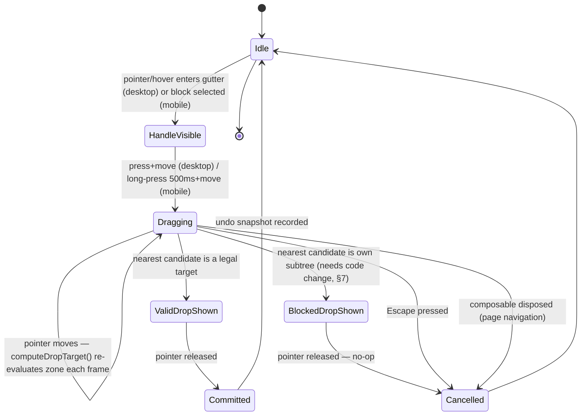
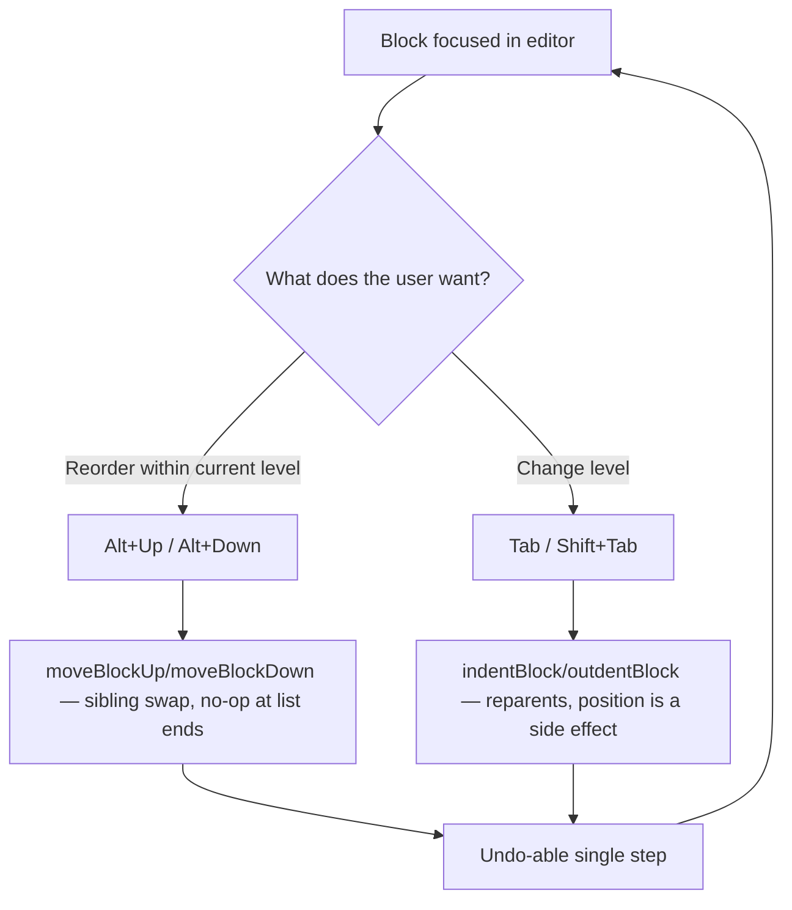

# Block Reorder — Interaction Permutation Matrix

**Feature**: Drag-and-Drop Block Reordering — design pass
**Status**: Design complete, implementation alignment pending
**Scope**: The single interaction of moving a block (or blocks) within a page — gutter drag, keyboard move, and the indent/outdent shortcuts that intersect with it. Not a whole-app review.
**Origin**: stelekit#237. Written after stelekit#238 (missing callback wiring) and a Compose recomposition race were fixed — those were platform-wiring bugs; this doc specifies the *intended* behavior end-to-end so remaining gaps can be judged against a decision, not a guess.
**Primary implementation files**: `kmp/src/commonMain/kotlin/dev/stapler/stelekit/ui/components/BlockList.kt` (drag state machine), `BlockGutter.kt` (gesture entry), `BlockItem.kt` (visual feedback), `ui/state/BlockStateManager.kt` (`moveSelectedBlocks`, `moveBlockUp`/`moveBlockDown`), `ui/state/BlockSelectionManager.kt` (`subtreeDedup`).

---

## 1. Non-goals

- Cross-page drag, sidebar/page-list drag, animated reorder transitions — all out of scope per `docs/tasks/drag-and-drop-reorder.md`'s original scope and unchanged here.
- Auto-scroll-while-dragging near viewport edges is discussed (§5.7) as a known limitation but is not re-scoped into this design pass — it was explicitly deferred in the original plan and nothing here changes that call.

---

## 2. Headline Decisions

The four permutations the issue calls out as highest-stakes, decided up front:

| Question | Decision | One-line rationale |
|---|---|---|
| Does a dragged block's subtree always follow? | **Yes, always.** No drag-time "flatten" affordance. | Predictability: one gesture, one outcome. Re-parenting children to the grandparent is a separate, rare intent ("ungroup") that deserves its own explicit command, not a hidden drag modifier. |
| Multi-select drag ordering | **Visual/document order is preserved.** Already correct in `moveSelectedBlocks` (`sortedSelected` by current visual position). | Matches the mental model: what you saw top-to-bottom before the move is what you see top-to-bottom after. |
| Multi-select spanning indent levels | **All selected roots (post-dedup) are normalized to one level** — the level implied by the single drop zone. | There is exactly one drop point per gesture (one pointer, one release). Giving different selected blocks different resulting levels from a single drop signal isn't a design choice available to make — it isn't representable. |
| ABOVE / CHILD / BELOW hit-box proportions | **40% / 20% / 40%**, not the current flat 33/33/33. CHILD gets a minimum absolute height floor (12dp) on short rows. | Reparenting is the highest-consequence, least-frequent zone — it should require deliberate aim. Sibling insertion (ABOVE/BELOW) is the common case and should be easy to hit. Matches the bias in Notion/Workflowy/Logseq-desktop. |

---

## 3. Data model recap (for matrix readers)

- Blocks form a tree via `parentUuid` + a fractional/lexicographic `position` string.
- `collapsedBlocks: Set<String>` in `BlockList` hides all descendants of a collapsed block from the rendered list — `blockBounds` (populated via `onGloballyPositioned`) simply never contains a hidden descendant's UUID, so a hidden block cannot be a drag source *or* a drop target while hidden. This is structural, not a runtime check.
- `BlockList` uses a plain `Column`, not a `LazyColumn` — the hosting screen (`PageView`/`JournalsView`) wraps the whole thing in one `LazyColumn` item. Practically: **every block on the page is composed and present in `blockBounds` regardless of scroll position**, which is why the nearest-block algorithm below "just works" at the top/bottom of a page. It's also why scroll is locked during drag (`onDragStateChange`) — scrolling would move blocks out from under stale `onGloballyPositioned` coordinates if it weren't.

---

## 4. Permutation Matrix

### 4.1 Single block, no children

| Source state | Drop zone | Target state | Outcome | Rationale |
|---|---|---|---|---|
| Root-level block | ABOVE | Any block | Becomes sibling before target, same parent as target | Standard sibling-insert |
| Root-level block | BELOW | Any block | Becomes sibling after target, same parent as target | Standard sibling-insert |
| Root-level block | CHILD | Any block | Becomes target's **first** child | See §4.6 for why "first," not "last" |
| Nested block | ABOVE/BELOW/CHILD | Any block, any level | Resolves to the target's level (§4.6) — outdent/indent-via-drag is implicit | This is how drag "moves across levels" without a separate mode |
| Any block | any zone | **Itself** | Not selectable as a target at all | `computeDropTarget` filters `uuid !in state.draggedUuids` from candidates (`BlockList.kt:175`) — self-drop is structurally impossible, not merely guarded |

### 4.2 Single block *with children* — subtree-follow decision

| Source state | Drop zone | Target state | Outcome | Rationale |
|---|---|---|---|---|
| Parent with N descendants (expanded or collapsed) | ABOVE/BELOW | Any valid non-descendant target | Entire subtree moves as a unit; descendants keep their existing `parentUuid` relationships, only the dragged root's `parentUuid`/`position` change | DD-07 in the original plan; matches Logseq/Workflowy default |
| Parent with descendants | CHILD | Any valid non-descendant target | Whole subtree becomes the target's first child; original parent-child structure inside the subtree is untouched | Same mechanism — only the root's parent link moves |
| Parent with descendants | any zone | **One of its own descendants** | **Rejected.** No move; see §4.8 for the required (currently missing) rejection visual | Prevents cycles in the tree |
| Parent with descendants | any zone | A block that is itself a descendant of a *different* selected root in the same multi-select | Rejected for the same reason, evaluated against the union of all dragged UUIDs' descendant sets | `BlockList.kt:304-305`, `getDescendantUuids` walks the full (not just visible) block list, so collapsed descendants are correctly included in the guard |

**Named tradeoff**: there is no fast path to move *just* the parent and re-parent its children to the grandparent ("flatten"/"ungroup") via drag. A user who wants that must outdent the children individually first, then drag the now-empty parent. This is intentional — conflating "move" and "flatten" into one gesture makes the common case (move-with-subtree) ambiguous to predict from pointer position alone. If this becomes a frequent request, it should ship as an explicit command (e.g. a context-menu "Move up a level, keep children here" action), not a drag modifier.

### 4.3 Collapsed subtrees — source and target

| Scenario | Outcome | Rationale |
|---|---|---|
| Dragging a **collapsed** parent block | Full subtree follows, identically to §4.2 | Collapse is a view-state flag (`collapsedBlockUuids`), not a structural property — the move operation never sees it |
| Attempting to drag a block that is currently **hidden** because an ancestor is collapsed | **Impossible.** No drag handle is rendered for it — it isn't in `blocks` iteration's visible set (`hiddenBlocks` filter, `BlockList.kt:220`) | User must expand the ancestor first. This is the correct default: dragging something you can't see the position of is an anti-pattern, not a missing feature |
| Dropping ABOVE or BELOW a **collapsed** block | Sibling insert next to the whole (still-collapsed) subtree, at the collapsed block's own level | The collapsed block's row is a valid, visible target — only its *children* are hidden |
| Dropping as CHILD (reparenting) **onto a collapsed** block | Becomes its new first child, but is now invisible until the target is expanded | **Needs a code change** (§7): the target should auto-expand on a successful CHILD-zone drop, or the drop should at minimum show a toast/hint ("Added as child of collapsed block — tap to expand"). Silently vanishing a just-moved block is a Nielsen H1 (visibility of system status) violation |

### 4.4 Multi-select drag

| Scenario | Outcome | Rationale |
|---|---|---|
| N blocks selected, all siblings, dragged as a group | Move preserves their relative visual order at the new location | `sortedSelected` in `BlockStateManager.moveSelectedBlocks` (`BlockStateManager.kt:449-452`) sorts by current visual position before moving |
| Selection spans multiple indent levels (e.g. a level-0 block and an unrelated level-2 block both checked) | Both are normalized to the **same** resulting level/parent — whichever the single drop zone implies | See Headline Decisions — one drop point cannot encode two different destinations |
| Selection contains **both an ancestor and one of its own descendants**, drag initiated from the **ancestor's** handle | Only the ancestor is in `draggedUuids`; standard subtree-follow behavior (§4.2) applies — descendant tags along automatically | `onDragStart`'s `toHighlight` logic (`BlockList.kt:279`) |
| Selection contains **both an ancestor and one of its own descendants**, drag initiated from the **descendant's** handle | Since the descendant is already in `selectedBlockUuids`, `toHighlight` becomes the *full* selection (`BlockList.kt:279-282`) — both are highlighted for the drag. At commit, `subtreeDedup` (`BlockSelectionManager.kt:101-112`) walks each candidate's ancestor chain and drops any UUID whose ancestor is also selected. Net effect: only the ancestor moves (carrying the descendant with it, since the descendant's own `parentUuid` is untouched). **Same correct outcome as the previous row.** | This resolves the exact scenario the original plan's "Bug 003" worried about — the concern was real for an earlier version of the code, but `onAutoSelectForDrag` being correctly wired (post-stelekit#238) plus `subtreeDedup` running unconditionally at commit means this permutation is *already handled correctly*, not a gap. See §7 for the regression test this needs. |
| Is an ancestor+descendant selection **draggable at all**? | **Yes** — explicitly confirmed above, not rejected | The issue asked this as an open question; answer is yes, by design of `subtreeDedup`, no special-case guard needed |

### 4.5 Zone hit-box proportions and visual feedback

| Zone | Current | Recommended | Rationale |
|---|---|---|---|
| ABOVE | 33% (top third) | **40%** | Enlarged at CHILD's expense — sibling-before is common and low-risk |
| CHILD | 33% (center third) | **20%, floor of 12dp absolute height** | Reparenting is high-consequence (structurally changes the tree, not just position) and should require deliberate aim, matching Logseq-desktop/Notion/Workflowy conventions where nesting-via-drop is intentionally the harder target to hit. The 12dp floor exists because 20% of a single-line block's ~40dp row height is only 8dp — too thin to reliably target on touch; the floor keeps CHILD reachable without growing it on short rows |
| BELOW | 33% (bottom third) | **40%** | Same rationale as ABOVE |
| Visual: ABOVE/BELOW | 2dp `HorizontalDivider` at the target's own indent level | **Keep as-is** | Already correct — thin horizontal line reads unambiguously as "insert here, at this level" |
| Visual: CHILD | Indented divider (`level+1`) **and** a full-row background tint on the target (`dividerColor.copy(alpha = 0.12f)`, `BlockItem.kt:300-306`, added under GAP-013) | **Keep as-is** | This is already the right call and already implemented: a divider alone reads identically to a sibling-insert differing only by a 24dp indent, which is too subtle for a structurally different, harder-to-undo-by-eye operation. The full-row tint gives CHILD its own distinct visual language, on top of (not instead of) the indent cue |

### 4.6 Why CHILD inserts as *first* child, not last

Current code (`onDragEnd`, `BlockList.kt:319-321`): `DropZone.CHILD -> onMoveSelectedBlocks(targetBlock.uuid.value, null)`. With `insertAfterUuid = null`, `moveSelectedBlocks` computes the insertion window as `(null, firstExistingChild.position)` — i.e. **before** any existing children.

**Decision: keep this.** It is spatially honest: the CHILD-zone divider renders directly below the target row (`dropBelow || dropAsChild` in `BlockItem.kt:472`), which is exactly where the *first* child appears in the rendered list. If CHILD instead appended as the *last* child, the divider's on-screen position (right under the parent) would visually lie about where the block lands whenever the parent already has children — the user would drop "under the parent" and the block would silently jump to the bottom of a multi-item child list, elsewhere on screen. First-child insertion keeps the visual promise and the outcome identical.

### 4.7 Top-of-list, bottom-of-list, and above the page title

| Scenario | Outcome | Rationale |
|---|---|---|
| Drop with pointer above the first block's midpoint | ABOVE zone on the first block → becomes the new first block on the page | `computeDropTarget`'s nearest-block-by-center-distance naturally degenerates to this; no special-case code needed |
| Drop with pointer below the last block's midpoint (including far below, past the visible list) | BELOW zone on the last block, unconditionally — `currentY > bounds.first + range*0.67` has no upper clamp, so any Y past that threshold still resolves to BELOW | Already correct: appending at the end works from any distance past the last block |
| "Drop above everything" affordance (a dedicated top-of-page drop target, distinct from ABOVE-on-first-block) | **Not needed as a separate mechanism** — ABOVE-on-first-block already covers it | Do not build a redundant affordance |
| Drop with pointer literally over the page title / above where blocks start | Same as "above the first block" — the page title isn't in `blockBounds`, so it's never a candidate itself, but the nearest surviving candidate is still the first block | No change needed |
| Drop far outside the `BlockList`'s own bounds (e.g. pointer dragged over the sidebar, a different screen region, or off-window on desktop) | **Currently commits anyway**, to whatever the nearest edge block happens to be — `computeDropTarget`'s `minByOrNull` has no bounds check and always returns a candidate if `blockBounds` is non-empty | **Needs a code change** (§7). A drop meaningfully outside the list's rendered region should cancel (behave like Escape), not silently commit to an edge block the user never intentionally targeted |

### 4.8 Keyboard move vs. drag move — decided as intentionally non-equivalent

| Path | Mechanism | Can reparent (change level)? | Can reorder within a level? |
|---|---|---|---|
| Drag (any zone) | `moveSelectedBlocks(newParentUuid, insertAfterUuid)` | Yes — any of the 3 zones can change `parentUuid` | Yes |
| Alt+Up / Alt+Down (`onMoveUp`/`onMoveDown`) | `blockRepository.moveBlockUp`/`moveBlockDown` — a same-parent sibling swap via the `left_uuid` linked list; **no-ops if the block is already first/last in its sibling list** (`SqlDelightBlockRepository.kt:836`, `:874`) | **No, never** | Yes, strictly within the current parent |
| Tab / Shift+Tab (`onIndent`/`onOutdent`) | `blockRepository.indentBlock`/`outdentBlock` — indent reparents under the previous sibling (as its last child); outdent reparents under the grandparent, positioned immediately after the former parent | Yes — this is the level-change primitive | No — position within the new level is a side effect (last-child-of-previous-sibling, or right-after-former-parent), not chosen |

**Decision: these must NOT be made to behave identically, and that's fine.** Drag collapses "change position" and "change level" into one continuous gesture because it has continuous 2D input to work with. Keyboard input doesn't have that — it necessarily splits the same capability into two discrete commands (Alt+Up/Down for position, Tab/Shift+Tab for level). **Reachability, not identical semantics, is the bar**: verified by hand-tracing the repository code above, any tree position reachable by drag is also reachable keyboard-only via some sequence of indent/outdent + move-up/move-down. That satisfies the accessibility requirement (§6) without forcing an artificial "keyboard drag" abstraction that would just be a worse version of the two existing, well-understood outliner shortcuts. Document this split explicitly in user-facing help text so users don't go looking for a keyboard "move to become a child of X" shortcut that doesn't need to exist.

### 4.9 Indent/outdent shortcuts interacting with an in-progress or just-completed drag

| Scenario | Current behavior | Decision |
|---|---|---|
| Tab/Shift+Tab pressed while a drag is in progress (possible on desktop if a *different* block still has editor focus while the mouse drags another block's handle) | Not intercepted — `BlockList`'s `onKeyEvent` only special-cases Shift+Arrow and Escape during drag (`BlockList.kt:199-212`); Tab reaches the focused editor normally and commits `onIndent`/`onOutdent` on an unrelated block mid-drag | **Should be suppressed while `dragState != null`.** Two concurrent structural mutations (the in-flight drag's eventual `moveSelectedBlocks` and an indent racing ahead of it) are a correctness risk even though they usually target different blocks — undo ordering becomes confusing (which one does Ctrl+Z reverse first?) and it's simply not a state a user should be able to reach. Needs a code change (§7) |
| Tab/Shift+Tab pressed immediately after a drag completes | No special handling needed — `dragState` is already null by the time the key event fires | Fine as-is; no interaction |
| Alt+Up/Alt+Down pressed while a drag is in progress | Same category as above — reaches the focused editor's `onMoveUp`/`onMoveDown` regardless of drag state | Same decision: suppress all structural keyboard shortcuts while `dragState != null` |

---

## 5. User Flows

### 5.1 Primary flow — drag reorder

### 5.2 Keyboard-alternative flow

---

## 6. Key States

| State | Trigger | Visual cue | Notes |
|---|---|---|---|
| **Idle / hover** | Default; pointer hovers a block's gutter (desktop only) | Drag handle icon fades from 0.45 alpha to 1.0 alpha (`BlockGutter.kt:147`, GAP-012) | On mobile the handle sits at a fixed 0.45–1.0 depending on `useLongPress`; hover doesn't apply to touch |
| **Drag-in-progress** | `detectDragGestures`/`detectDragGesturesAfterLongPress` fires `onDragStart` | `BlockDragGhost` card follows the pointer (`.offset(...) - 24.dp`, lifted above the finger on touch), shows "N block(s)" count | Scroll is locked on the hosting `LazyColumn` for the duration (`onDragStateChange`) |
| **Valid drop target** | `computeDropTarget` resolves to a legal candidate | ABOVE/BELOW: 2dp divider at target's indent level. CHILD: indented divider + full-row tint (§4.5) | |
| **Invalid drop (own subtree)** | Nearest candidate is inside the dragged selection's own descendant set | **Currently: none — same divider as a valid drop, silently rejected on release.** Needs a code change (§7): suppress the divider/tint on blocked candidates and give the ghost a distinct error-state treatment (e.g. red outline, no-drop cursor) so the rejection is visible *during* the drag, not discovered after release | This is the most user-visible gap this doc surfaces |
| **Drag-cancelled (Escape)** | `Key.Escape` while `dragState != null` | Ghost and divider disappear immediately; block returns to original position (it never moved) | `BlockList.kt:207-212`, already correct |
| **Drag-cancelled (drop outside bounds)** | Pointer released far outside the list's rendered region | **Currently: commits to nearest edge block instead of cancelling.** Needs a code change (§7) | |
| **Post-drop** | Successful commit | Block(s) render at new position; no animation currently (out of scope per original plan) | Undo snapshot recorded via `BlockStateManager.record()` |

---

## 7. Accessibility

- **Touch target sizing**: the drag handle's *hit area* is a fixed 48×48dp `Box` (`BlockGutter.kt:71-79`), independent of the visually smaller 18dp icon inside it — this already matches the touch-target guidance found elsewhere in this repo's design docs (e.g. `project_plans/android-ux-overhaul/requirements.md`'s "all interactive elements have touch targets of 48×48dp minimum," and `docs/ux/journey-map.md`'s Cross-Cutting Gap #8 flagging *other* sub-48dp targets in the sidebar). There is no single canonical `docs/ux.md` criteria file in this repo currently — `BlockGutter.kt`'s "ux.md criterion 19" comment is a holdover reference to that project-plan doc's numbered acceptance criteria, not a file that exists at that path. Worth reconciling into one canonical criteria doc at some point, but out of scope here.
- **Non-drag reorder path**: Alt+Up/Alt+Down + Tab/Shift+Tab together are the accessible peer to drag, per §4.8's reachability argument — not Alt+Up/Down alone. This should be stated explicitly wherever the feature is documented for users (tooltip, help panel), since a user who only discovers Alt+Up/Down will reasonably conclude "I can't reparent without the mouse," which is false.
- **Discoverability**: the same GAP-012 finding that motivated the 0.45-alpha idle state for the drag handle (visible-by-default rather than 0-alpha-until-hover) applies double to the keyboard path — there is currently no in-UI hint that Tab/Shift+Tab/Alt+Up/Alt+Down exist at all. This is a pre-existing gap (`docs/ux/journey-map.md` doesn't cover it either, since that doc is whole-app scope) and is flagged here as a backlog item, not a blocker for #237.
- **`useLongPressForDrag` (Android)**: the 500ms long-press-before-drag requirement is a correct and necessary accessibility tradeoff — it prevents drag from hijacking normal list-scroll gestures — but it does mean Android touch users pay a fixed latency tax on every drag that desktop users don't. No change recommended; this is the standard mobile outliner pattern (matches Logseq mobile, Notion mobile) and the keyboard path is the escape hatch for users who find long-press unreliable (e.g. motor-impairment users using switch access, where Alt+Up/Down-equivalent external-keyboard shortcuts are the primary path anyway).

---

## 8. What's already correct vs. needs a code change

### Already correct — no action needed

| # | Decision | Where verified |
|---|---|---|
| 1 | Subtree always follows the dragged root | `onDragEnd`'s move calls operate on `toMove` roots only; descendants' `parentUuid` untouched |
| 2 | Self-drop is structurally impossible | `computeDropTarget`'s candidate filter, `BlockList.kt:175` |
| 3 | Own-subtree-drop is rejected at commit | `isOwnSubtree` guard, `BlockList.kt:304-306` |
| 4 | Collapsed source blocks aren't draggable (hidden descendants) | `hiddenBlocks` filter, `BlockList.kt:220`, structural |
| 5 | Multi-select visual-order preservation | `sortedSelected`, `BlockStateManager.kt:449-452` |
| 6 | Ancestor+descendant multi-select drag (§4.4) | `onAutoSelectForDrag` wiring (post-stelekit#238) + `subtreeDedup`, `BlockSelectionManager.kt:101-112` — resolves the original plan's "Bug 003" concern |
| 7 | CHILD-zone visual distinctness (indent + full-row tint) | `BlockItem.kt:300-306`, GAP-013 |
| 8 | CHILD inserts as first child (spatially honest with the divider position) | `moveSelectedBlocks`'s `null` `afterPosition` handling |
| 9 | Top/bottom-of-list drops via nearest-block algorithm, no dedicated widget needed | `computeDropTarget`, unclamped BELOW threshold |
| 10 | Escape-to-cancel | `BlockList.kt:207-212` |
| 11 | Drag state cleanup on composable disposal (page navigation mid-drag) | `DisposableEffect`, `BlockList.kt:163-170` |
| 12 | Drag handle 48dp touch target independent of icon size | `BlockGutter.kt:71-79` |
| 13 | Android long-press gesture gating | `BlockGutter.kt`'s `useLongPress` branch |
| 14 | `onAutoSelectForDrag` wired on both `PageView` and `JournalsView` | Verified directly — `PageView.kt:505`, `JournalsView.kt:268` — this was the stelekit#238 fix and is confirmed still in place |

### Needs a code change

| # | Gap | Decision this violates | Suggested direction |
|---|---|---|---|
| 1 | **No distinct visual for own-subtree (invalid) drop targets** — the ABOVE/BELOW/CHILD divider renders identically whether the target is legal or will be silently rejected at release | §4.8 key-states table, "Invalid drop (own subtree)" | Have `computeDropTarget` compute the own-subtree guard *during* the drag (not just at `onDragEnd`) and expose an `isBlocked: Boolean` alongside `dropTargetUuid`/`currentDropZone`. `BlockItem` should suppress the normal divider/tint when blocked and `BlockDragGhost` should switch to an error-colored treatment (e.g. red border, no-drop icon) |
| 2 | **Dropping onto a collapsed block via CHILD zone doesn't auto-expand it** — the moved block becomes invisible with no feedback | §4.3, "Dropping as CHILD onto a collapsed block" | On successful CHILD-zone commit, if the target is in `collapsedBlocks`, remove it from that set (auto-expand) so the just-moved block is immediately visible |
| 3 | **No bounds check on drop target resolution** — releasing far outside the `BlockList`'s rendered region still commits to the nearest edge block instead of cancelling | §4.7, last row | Add a distance or explicit-bounds check in `computeDropTarget`/`onDragEnd`: if the pointer's last known position is outside the `BlockList` `Box`'s own layout bounds (or beyond some margin past the first/last block), null out `dropTargetUuid` and treat drag-end like Escape |
| 4 | **Structural keyboard shortcuts (Tab/Shift+Tab, Alt+Up/Down) aren't suppressed during an active drag** | §4.9 | Extend `BlockList`'s `onKeyEvent` (or the shortcut dispatch point in `BlockEditor`) to no-op indent/outdent/move-up/move-down whenever `dragState != null` |
| 5 | **Hit-box proportions are flat 33/33/33**, not the recommended 40/20/40 with a floor | §4.5 | Update the three thresholds in `computeDropTarget` (`BlockList.kt:181-183`) and add the 12dp CHILD-zone floor |
| 6 | **No regression test for the ancestor+descendant multi-select drag permutation (§4.4)**, even though the current code already handles it correctly | §4.4 | Add a `businessTest` that selects a parent and one of its own children, drags from the child's handle, and asserts only one move occurs and the resulting tree is unchanged in relative structure — this is cheap insurance against a future refactor silently reintroducing the original "Bug 003" |
| 7 | **No test coverage for the drop-zone proportions themselves** once changed | §4.5 | Extend `BlockListDropZoneTest` (referenced in the original plan's test strategy) with cases at 19%/21% and 39%/41% boundaries to lock in the new 40/20/40 split |
