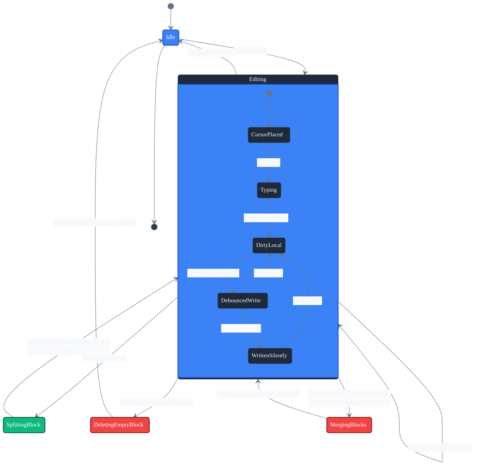
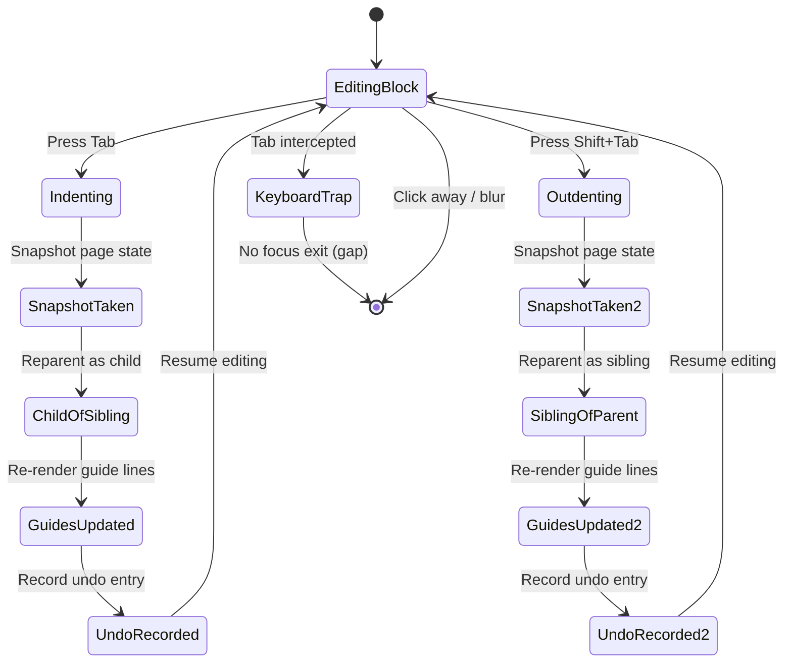
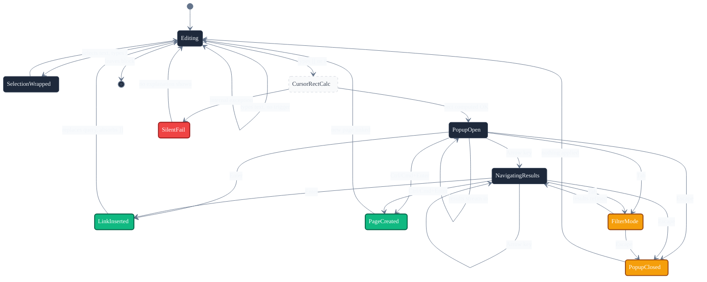
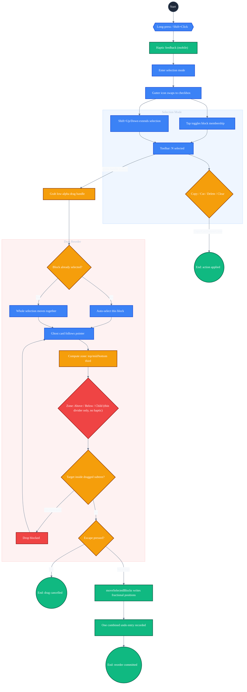
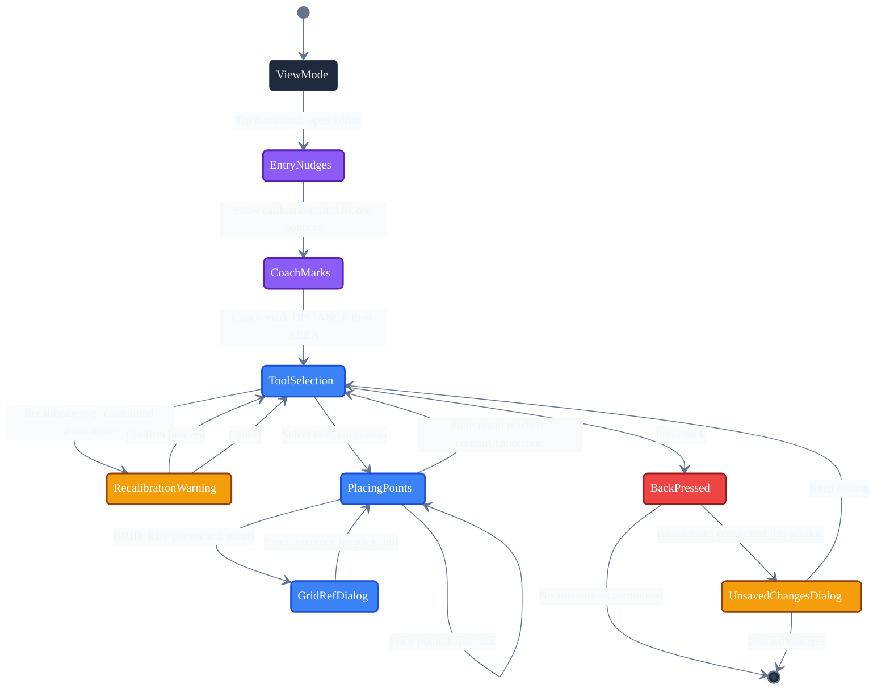

# User Journey Map — SteleKit Block Editor

> Generated 2026-07-03. Focus: the block editor experience (editing, structuring, linking, and
> resolving conflicts within `BlockEditor` / `BlockStateManager` and the outliner UI). Excludes
> search, graph management, and git sync except where they interrupt an active edit.

## User Types

| Type | Description | Primary activities |
|---|---|---|
| New user | Unfamiliar with outliner/Markdown conventions | Write and structure notes, format text |
| Desktop power user | Keyboard-first, uses shortcuts and command palette | All activities, especially reorganize, shortcuts, bulk ops |
| Mobile note-taker | Touch-first, relies on the mobile toolbar | Write and structure notes, insert rich content, formatting via toolbar |

## Story Map Backbone

| Activity | Users | Key tasks |
|---|---|---|
| Write and structure notes | All | Type into a block, split with Enter, merge with Backspace, indent/outdent (Tab/Shift+Tab), navigate blocks, collapse/expand, edit journal entries |
| Format text | Desktop, Mobile | Bold/Italic/Strikethrough/Highlight/Code shortcuts, mobile toolbar formatting row, block-type read-mode rendering |
| Link and reference other notes | Desktop, Mobile | `[[` and `#` autocomplete, inline page creation, selection-wrap linking, tap-to-navigate links, image markdown insertion |
| Reorganize the outline | Desktop (primarily) | Multi-select (long-press/Shift+Click), drag-to-reorder with ABOVE/BELOW/CHILD zones, copy/cut/paste subtrees, bulk delete/move |
| Undo and redo edits | All | Ctrl/Cmd+Z / Shift+Z, mobile toolbar undo/redo buttons, cursor-position-aware restore |
| Use editor shortcuts and command surfaces | Desktop power user | Command palette, global search, sidebar toggles, page history nav, word/line cursor movement |
| Insert and manage rich content | Mobile, Desktop | Attach/capture images, drag-and-drop files, paste images, open the image-annotation sub-editor, inline table/code/list/quote blocks |
| Get AI-assisted suggestions | All | Tag suggestions, accept/reject suggested page links, review all detected suggestions on a page |
| Resolve edit conflicts | All | Continue editing under dirty-block protection, respond to `DiskConflictDialog`, choose Keep/Use disk/Save as new/Manual resolve |

## Journeys

### Block creation, split & merge (core typing loop)
**Trigger**: User taps into a block and begins typing, or presses Enter/Backspace while editing.
**Emotional tone**: Routine but uncertain — typing feels instant and first-class, but there is zero durability confirmation.
**Steps**:
1. Tap block → enter edit mode → cursor placed.
2. Typing updates local state, marks the block dirty, and debounces (300ms local + 500ms disk) before any file write — no save indicator shown at any point.
3. Enter (mid-sentence, no selection) → block splits at the cursor; a new sibling block is created below and takes focus.
4. Shift+Enter inserts a literal newline within the same block instead of splitting.
5. Backspace on an empty block deletes it and moves focus to the previous/parent block.
6. Backspace on a non-empty block merges it into the previous block; cursor placement after merge is unverified in code.

**Gaps / UX notes**:
- No visible saving/saved/failed indicator anywhere in the core loop (Nielsen: Visibility of System Status).
- DB write failures are only `logger.warn`'d — silently swallowed from the user's perspective.
- Shift+Enter vs. Enter is a powerful distinction with zero discoverability (no tooltip/legend).
- No `Ctrl+Z` handler was found wired in `BlockEditor.handleKeyEvent` despite `BlockUndoManager` existing — undo may be mobile-toolbar-only on desktop, worth verifying.

---

### Indent / outdent (Tab / Shift+Tab)
**Trigger**: User presses Tab or Shift+Tab while editing a block.
**Emotional tone**: Routine, satisfying — instant guide-line feedback reinforces the hierarchy mental model.
**Steps**:
1. Tab → page state snapshot → block reparented as child of previous sibling → guide lines re-render → one undo entry recorded.
2. Shift+Tab → snapshot → block reparented as sibling of its former parent → guide lines update → one undo entry recorded.

**Gaps / UX notes**:
- Tab is fully repurposed for structure with no visible Escape/exit path in `handleKeyEvent` — a potential keyboard trap for keyboard-only or screen-reader users (POUR: Operable).

---

### Wiki-link and hashtag autocomplete
**Trigger**: User types `[[` or `#` inside a block, or selects text and types `[`.
**Emotional tone**: Excited/fluid when working — a low-friction, well-built core linking flow — but undiscoverable and can fail silently.
**Steps**:
1. Regex match on text before the cursor triggers the autocomplete popup, positioned at a live cursor rect.
2. Search runs against existing pages; results stream into a dropdown.
3. Arrow keys navigate; Enter applies the selection, replacing the query with `[[Page Name]]` and absorbing any pre-existing `]]`.
4. Ctrl/Cmd+Enter creates a brand-new page from the typed query and links it.
5. Tab enters a filter-refinement mode; Escape closes the popup with nothing applied.
6. Separately, selecting text then typing `[` wraps the selection in `[[ ]]`.

**Gaps / UX notes**:
- `getCursorRect` is wrapped in try/catch that silently no-ops the whole popup on any exception — fails with zero explanation.
- No visible hint that `[[` or `#` trigger anything — pure tribal knowledge.
- Mobile soft-keyboard `[` handling relies on a fragile IME pattern-match heuristic with no fallback messaging.

---

### Multi-block selection and drag reorder
**Trigger**: Long-press a block (mobile) or Shift+Click (desktop); or grab the drag handle directly.
**Emotional tone**: Highest cognitive load in the editor — precise three-way drop-zone disambiguation risks "did that drop where I meant?" anxiety.
**Steps**:
1. Long-press/Shift+Click → haptic feedback (mobile) → enters selection mode → gutter icon swaps to a checkbox.
2. Tap toggles block membership; Shift+Up/Down extends selection on desktop. Toolbar shows "N selected" with Copy/Cut/Delete/Clear.
3. Grabbing the (nearly invisible, low-alpha) drag handle instead: auto-selects the block if not already selected, or moves the whole selection if it was.
4. A ghost card follows the pointer; drop zone is computed from vertical thirds (ABOVE/BELOW/CHILD), shown only as a thin colored divider.
5. Dropping onto the dragged subtree itself is blocked. Escape cancels the drag.
6. Successful drop writes new fractional-index positions and records one combined undo entry.

**Gaps / UX notes**:
- CHILD drop-zone has no distinct visual affordance beyond a divider indent shift — easy to mis-drop and silently re-parent content with no confirmation.
- Drag only starts from a tiny (18dp), near-invisible handle — slower and more error-prone than direct-drag-on-row patterns.
- No haptic feedback on drag start/drop, inconsistent with the haptic-confirmed long-press-to-select gesture.

---

### Disk conflict during active edit
**Trigger**: The markdown file backing the open page changes externally (e.g. git pull, another device) while the user has unsaved/unconfirmed local edits.
**Emotional tone**: The single most anxiety-inducing moment in the editor — directly threatens the user's "is my work safe?" mental model. The forced, non-dismissable dialog is the right call for data-loss risk, but can feel jarring.
**Steps**:
1. External change detected. If it's not the currently open page → a silent `PendingConflict` is stored and only a dismissible snackbar is shown.
2. If it is the open page, a four-tier protection check runs: actively editing? dirty blocks? pending disk write? actor pending writes?
3. If any tier is true → pending autosave is cancelled, auto-reimport suppressed, a `DiskConflict` is built from local vs. disk content, and the non-dismissable `DiskConflictDialog` appears with 200-char-truncated previews.
4. User resolves via Keep my changes / Use disk version / Save my edit as a new block / Manual resolve (injects git-style conflict markers and reopens the block).
5. If none of the four tiers are true, the disk version silently auto-imports.
6. Returning to a page with an earlier snackbar'd pending conflict re-triggers the full dialog.

**Gaps / UX notes**:
- "Disk version" and "Your edit" previews are at mismatched granularities (near-whole-file vs. single block) — hard to actually compare.
- "Manual resolve" assumes git conflict-marker literacy with no inline explanation.
- 200-char truncation with no "view full" expansion could hide the actual differing content.
- No persistent visual marker (e.g. sidebar badge) for a page with a pending conflict between the snackbar disappearing and the user navigating back — easy to forget.

```mermaid
%%{init: {'theme': 'base', 'themeVariables': {
  'primaryColor': '#1E293B',
  'primaryTextColor': '#F1F5F9',
  'primaryBorderColor': '#334155',
  'lineColor': '#64748B',
  'edgeLabelBackground': '#F8FAFC',
  'fontFamily': 'ui-sans-serif, system-ui',
  'fontSize': '14px'
}}}%%
flowchart TD
  A[External file change detected] --> B{Same page open?}

  B -->|No| C[Store PendingConflict silently]
  C --> D[Show dismissible snackbar]
  D --> U{User returns to page}
  U --> V[Full dialog re-triggers]
  V --> M

  B -->|Yes| E1

  subgraph protect["Four-Tier Protection Check"]
    direction TD
    E1{Actively editing?}
    E2{Dirty blocks exist?}
    E3{Pending disk write?}
    E4{Actor pending writes?}
    E1 -->|No| E2
    E2 -->|No| E3
    E3 -->|No| E4
  end

  E1 -->|Yes| J
  E2 -->|Yes| J
  E3 -->|Yes| J
  E4 -->|Yes| J
  E4 -->|No| T[Auto-reimport disk version]

  J[Cancel pending autosave] --> K[Suppress auto-reimport]
  K --> L[Build DiskConflict object]
  L --> M[Show DiskConflictDialog]
  M --> N{User picks resolution}

  subgraph resolve["Resolution Choice"]
    direction TD
    O[Keep my changes]
    P[Use disk version]
    Q[Save edit as new block]
    R[Inject conflict markers]
    S[Reopen block for editing]
    R --> S
  end

  N -->|Keep mine| O
  N -->|Use disk| P
  N -->|Save as new block| Q
  N -->|Manual resolve| R

  classDef start    fill:#1a6fad,stroke:#0F3D5C,color:#fff,stroke-width:2px
  classDef check    fill:#334155,stroke:#1E293B,color:#F1F5F9,stroke-width:1.5px
  classDef silent   fill:#F59E0B,stroke:#92400E,color:#1E1B16,stroke-width:2px
  classDef danger   fill:#EF4444,stroke:#7F1D1D,color:#fff,stroke-width:3px
  classDef safe     fill:#10B981,stroke:#065F46,color:#fff,stroke-width:2px
  classDef risky    fill:#F97316,stroke:#7C2D12,color:#fff,stroke-dasharray:4 3,stroke-width:2px
  classDef ghost    fill:#F9FAFB,stroke:#D1D5DB,color:#374151,stroke-dasharray:5 5

  class A start
  class B,E1,E2,E3,E4,N check
  class C,D,U,V silent
  class T ghost
  class J,K,L,M danger
  class O,P,Q safe
  class R,S risky

  style protect fill:#0F172A,stroke:#334155
  style resolve fill:#0F172A,stroke:#334155
```

---

### Image annotation sub-editor
**Trigger**: User taps an `image_annotation` block's thumbnail in view mode.
**Emotional tone**: Notably more UX-considered than the core editor — coach marks, contextual banners, haptic confirmation, and a real unsaved-changes guard suggest deliberate onboarding investment, ironic given it's used far less often than core editing.
**Steps**:
1. Navigate to full-screen `AnnotationEditorScreen` with its own toolset (SELECT/DISTANCE/AREA/ANGLE/LABEL/GRID_REF), a separate undo/redo stack, and a calibration system.
2. Entry shows contextual nudges: first-use/repeat calibration banner, sensor tilt warning, ARCore accuracy disclaimer, progressive coach marks (DISTANCE, then AREA).
3. Selecting a tool and tapping the canvas accumulates points until the tool's required count is reached; `commitAnnotation` fires with haptic feedback on each commit.
4. GRID_REF pauses after 2 points for a "Set reference length" dialog to compute calibration.
5. Recalibrating over already-committed annotations triggers a confirmation warning gate.
6. Back-navigation is intercepted; an `UnsavedChangesDialog` appears if annotations were committed this session.

**Gaps / UX notes**:
- Internal inconsistency: this showcase sub-feature has onboarding and an unsaved-changes gate that the much-more-frequently-used core block editor entirely lacks.
- Separate undo/redo stack from `BlockUndoManager` with no visible indicator of which undo-scope is currently active.
- Potential banner stacking (calibration + tilt + ARCore + GPS) could push the canvas below the fold.

---

## Other Journeys Identified (not diagrammed)

- **Multi-block selection & bulk operations** — checkbox toggle, Shift+arrow extend, bulk delete/move, one undo entry per batch. Confident once active; no confirmed pure-keyboard entry point into selection mode (pointer/touch-dependent).
- **Copy/Cut/Paste of block subtrees** — clipboard survives selection changes (supports multi-paste); cut blocks render at 40% alpha as a "pending cut" signal; atomic paste failures return silently with no user feedback.
- **Block collapse/expand** — conventional, unremarkable; no indicator of how much content is hidden.
- **Selection-wrap linking & formatting shortcuts** (Ctrl/Cmd+B/I/S/H/E/K) — powerful but entirely undiscoverable; no tooltip, legend, or menu surfaces any of it.

## Cross-Cutting Gaps

1. **No save-state indicator anywhere in the core editor.** The single highest-impact Visibility-of-System-Status violation, worsened by silent multi-hundred-ms debounce windows before disk persistence and write failures that only `logger.warn`.
2. **Two dead/unwired subsystems.** A full slash-command backend (`editor/commands/`: `SlashCommandHandler`, `EssentialCommands` for `/bold`, `/todo`, `/indent`, `/image`, etc.) is never invoked from `BlockEditor`'s text input. Most Command Palette entries for text formatting/block ops call `commandManager.executeCommand()` but discard the returned result — they are functional no-ops.
3. **Zero shortcut discoverability.** The rich desktop keyboard shortcut set (Ctrl/Cmd+B/I/S/H/E/K, `[` wrap, Ctrl+Arrow word-nav, Alt+Up/Down move, Tab/Shift+Tab indent) has no tooltip, legend, or menu surfacing it anywhere.
4. **Inconsistent error handling.** Most data-layer write failures (content, paste, snapshot restore, properties) are silently logged, while the team clearly knows how to build good error UX elsewhere (`DiskConflictDialog`, indexing-error banner) — the inconsistency itself is the gap.
5. **Two independent undo/redo systems** (`BlockUndoManager` for the outline, a separate stack in `AnnotationEditorViewModel`) with no shared visual language for which scope Ctrl+Z currently affects.
6. **Uneven onboarding investment.** The rarely-used annotation sub-editor has coach marks and nudge banners; the far-more-frequent core block editor has none for its own non-obvious gestures (Shift+Enter, `[[`, drag-to-reparent, long-press-select).
7. **Uncertain keyboard-only accessibility.** No Escape-to-exit-edit-mode handler was found, Tab is fully consumed for indent with no exit path, and multi-select entry appears pointer/touch-dependent.
8. **Dead settings.** `EditorSettings.kt` toggles (Logical Outdenting, Wide Mode, Show Brackets) are wired to no-op lambdas. TODO/DOING/DONE toggling has a command definition but no reachable UI trigger.

## Documentation Opportunities

- "Keyboard Shortcuts Reference" — surface the full Ctrl/Cmd shortcut set that currently has zero in-app discoverability.
- "Linking Your Notes" — explain `[[`, `#`, and selection-wrap linking for new users.
- "What Happens When Files Change Outside the App" — explain the disk-conflict dialog and resolution options before a user hits it cold.
- "Reorganizing Your Outline" — drag-to-reorder zones (Above/Below/Child) and multi-select, given this is the highest-cognitive-load flow.
