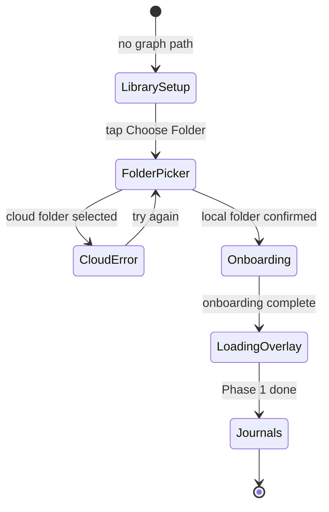
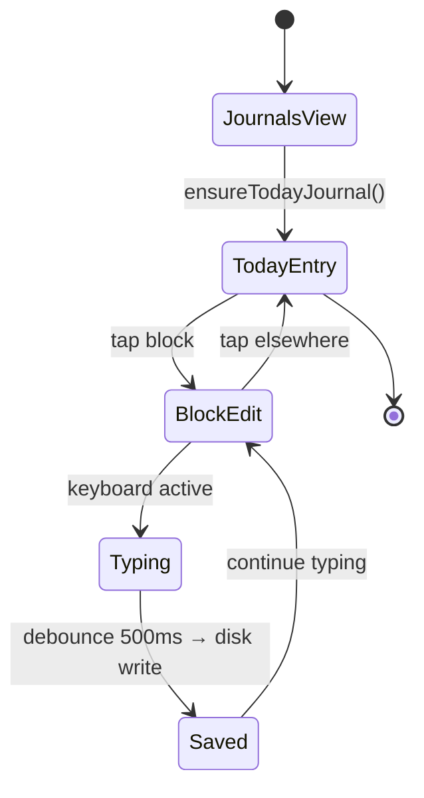
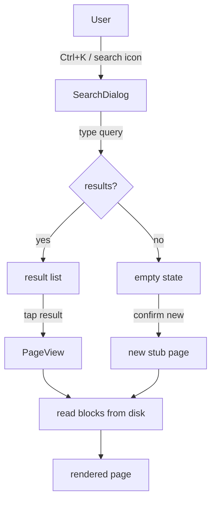
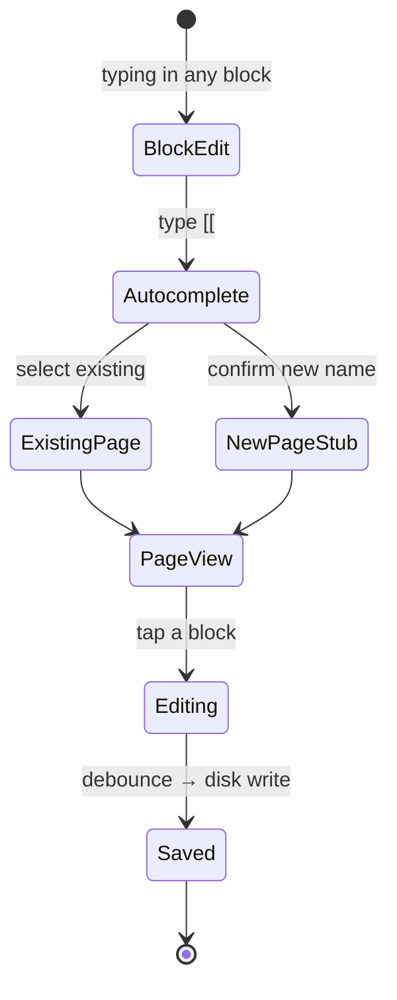
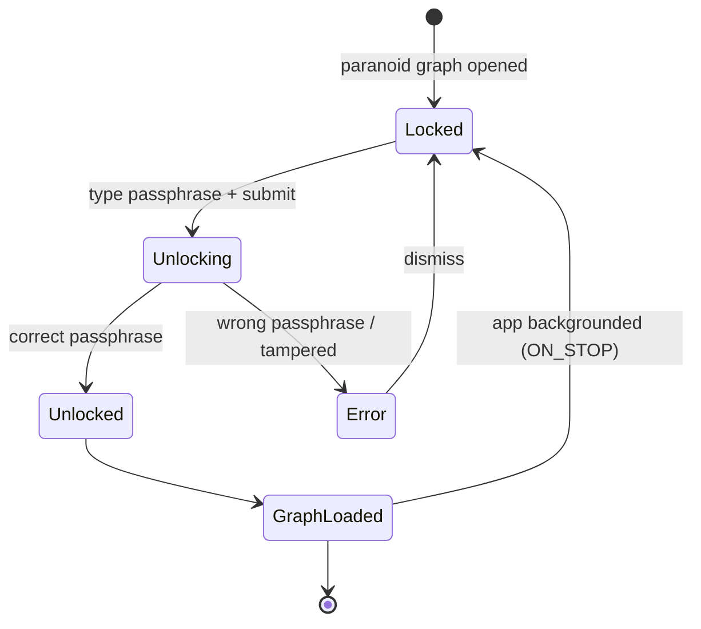
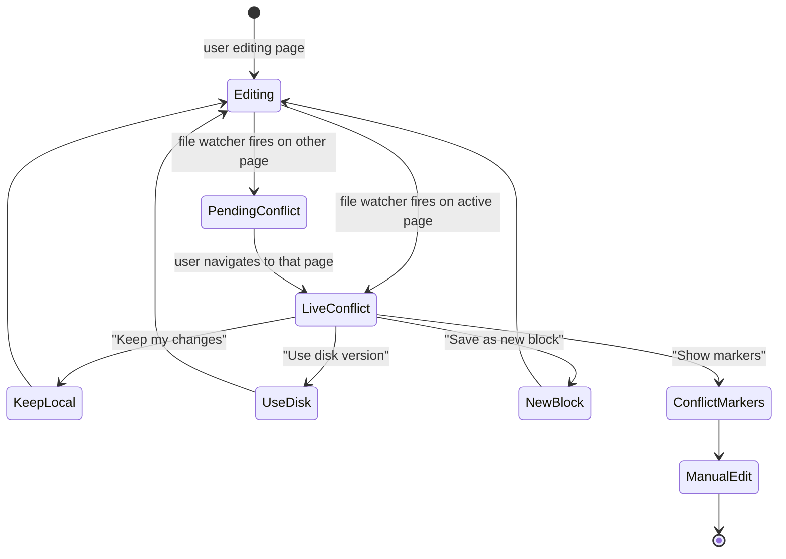

# User Journey Map — SteleKit
> Generated 2026-07-04. Focus: whole app.

## User Types

| Type | Description | Primary Activities |
|---|---|---|
| Daily Journaler | Captures thoughts, tasks, and events every day | Capture & Journal, Manage Tasks |
| Knowledge Worker | Builds a networked personal knowledge base | Navigate & Read, Search & Discover, Organize & Maintain |
| Power User | Uses advanced features: queries, vault, sections, LLM | All activities |
| Team Collaborator | Shares a graph via git sync | Sync & Share |
| Mobile User | Primary platform is Android or iOS | Capture & Journal, Navigate & Read |

---

## Story Map Backbone

| Activity | Users | Key Tasks |
|---|---|---|
| **Capture & Journal** | Daily Journaler, Knowledge Worker | Write/edit blocks, indent children, embed images, wiki links, tags/properties, task markers, SCHEDULED/DEADLINE |
| **Navigate & Read** | All | Sidebar nav (favorites/recents), wiki link clicks, back/forward, block focus mode, All Pages, gallery, command palette |
| **Search & Discover** | Knowledge Worker, Power User | Cmd/Ctrl+K search, FTS results, `{{query}}` blocks, Global Unlinked References, LLM suggestion inbox |
| **Organize & Maintain** | Knowledge Worker, Power User | New page, rename w/ backlink update, favorite, section assign, bulk delete, disk conflict resolution, image annotation |
| **Manage Tasks** | Daily Journaler, Power User | Cycle TODO/DOING/DONE, agenda view, SCHEDULED/DEADLINE dates, priority badges |
| **Sync & Share** | Knowledge Worker, Team Collaborator | Git sync setup/trigger, merge conflict resolution, export (MD/HTML/JSON), Google Drive share, URL import |
| **Set Up & Configure** | All | First-run onboarding, multi-graph add/switch, vault unlock, theme/language, LLM provider, section manifests |

---

## Journeys

### 1. First Launch & Onboarding

**Trigger**: Fresh install, or `onboardingCompleted = false` in persisted settings.
**Emotional tone**: Cautious curiosity — "graph" is technical jargon absent from the setup screen.

**Steps**:
1. App boots → `currentGraphPath` empty, no SAF permission → `LibrarySetupScreen` shown
2. User sees "Choose your notes folder" with a single button
3. Taps "Choose Folder" → OS folder picker via `fileSystem.pickDirectoryAsync()`
4. Success: `currentGraphPath` set, `permissionGranted = true` → `Onboarding` composable shown
5. Cancel / cloud folder: `folderPickError` shown inline ("not Google Drive or cloud storage")
6. Onboarding completes → `graphManager.addGraph(path)` → `switchGraph(id)`
7. `LoadingOverlay("Initializing…")` during migration → Phase 1 done → `Screen.Journals` shown

**Gaps / UX notes**:
- No explanation of what a "graph" is before requesting folder access
- No sample content for first-time users — Journals view is empty until the user writes
- Cloud-folder error surfaces only after failure, not as a pre-picker warning
- Desktop bypasses SAF entirely; onboarding experience differs with no parity documentation

---

### 2. Daily Journal Entry

**Trigger**: App opens (or user navigates home); `Screen.Journals` is the default screen.
**Emotional tone**: Routine, habitual — the core daily driver; friction here has outsized retention impact.

**Steps**:
1. `JournalsView` renders entries in reverse-chronological order
2. `ensureTodayJournal()` fires → today's entry appears at top
3. User taps a block → block enters edit mode
4. User types; `BlockStateManager` holds local state
5. 500ms debounce → `GraphWriter.saveBlock()` writes markdown to disk
6. User taps elsewhere → block exits edit mode

**Gaps / UX notes**:
- Dates render as ISO 8601 (`2026-01-21`) not human-readable ("Wednesday, January 21") — Nielsen H2 [MED-4]
- Last visible block hidden behind `MobileBlockToolbar` (96dp hardcoded padding) on mobile [CRIT-1]
- Infinite scroll bottom indicator is an empty `Box` — no spinner, no system status [LOW-5]
- No empty-state prompt for today's journal when no blocks exist
- No save indicator — users can't see that writes are durable

---

### 3. Search & Navigate to Page

**Trigger**: User wants to find an existing note by name or content.
**Emotional tone**: Goal-focused, slightly time-pressured — search friction maps directly to perceived performance.

**Steps**:
1. Desktop: Ctrl+K → `SearchDialog` overlays content; Mobile: tap search icon in bottom bar
2. User types → `SearchViewModel` queries `searchRepository` reactively
3. User taps result → `navigateTo(Screen.PageView(page))` → slide-in animation
4. `loadFullPage` re-reads from disk (`isContentFetching = true`) → page renders

**Gaps / UX notes**:
- `SearchDialog` uses `padding(top = 100.dp)` on mobile — input far from thumb zone [HIGH-3]
- No sidebar affordance visible when sidebar is collapsed — search is hidden with it [MED-3]
- TopBar "new page" button (`onNewPageClick`) opens search, not a creation dialog — label/destination mismatch
- `navigateToPageByName` silently creates a new stub page if none exists — users may not realize they created a page

---

### 4. Create & Edit a Named Page

**Trigger**: User wants to create a new note topic outside the daily journal.
**Emotional tone**: Creative initially; anxiety if the creation path isn't obvious.

**Steps**:
1. User types `[[Page Name]]` in any block → autocomplete dropdown via `AhoCorasickMatcher`
2. User confirms new name → `navigateToPageByName("Page Name")`
3. Page not in DB → loader attempted → stub created on disk
4. `navigateTo(Screen.PageView(newPage))` → user edits blocks → auto-save

**Gaps / UX notes**:
- No primary "New Page" button anywhere in nav (top bar, sidebar, bottom bar) — creation is wiki-link-only [Nielsen H6]
- No visual distinction between navigating to an existing page vs. creating a new one
- Both `navigateTo` and stub creation are silent — no confirmation

---

### 5. Paranoid-Mode Vault Unlock

**Trigger**: Graph has a `.stele-vault` file and `CryptoEngine` is available on platform.
**Emotional tone**: Anxious and high-stakes — forgotten passphrase = permanently inaccessible graph.

**Steps**:
1. `vaultState = VaultState.Locked` → `VaultUnlockScreen` shown; passphrase field auto-focused
2. User types passphrase → taps "Unlock" or IME Done
3. `VaultState.Unlocking` → spinner shown, field disabled
4. Success: `CryptoLayer` injected → `VaultState.Unlocked` → graph loads normally
5. Failure: `VaultState.Error` → inline "Incorrect passphrase." message

**Gaps / UX notes**:
- No passphrase recovery path — forgotten passphrase = permanent data loss, not communicated at vault-creation time
- `HeaderTampered` error shows same message as wrong passphrase (plausible deniability) — users with tampered files get no actionable guidance
- Vault auto-locks on `ON_STOP` silently — no countdown warning
- "Advanced" button (hidden volume) rendered at `alpha = 0.5f` — correct for security model, invisible to users who need it

---

### 6. Import External Content

**Trigger**: User wants to bring an article or document into the graph as a new page.
**Emotional tone**: Exploratory but cognitively demanding — many micro-decisions before saving.

**Steps**:
1. `Screen.Import` via command palette → `InputStage` (tabs: "Paste text" / "From URL")
2. User pastes text or enters URL → content fetched → user names the page → "Next: Review links"
3. `ReviewStage`: topic chips (existing pages), suggested new pages with confidence dots
4. User accepts/dismisses suggestions → "Import page"
5. `confirmImport()` → snackbar "Pages created" with Undo → navigates to new page

**Gaps / UX notes**:
- "Review links" is jargon — users unfamiliar with wiki-link model won't understand
- Confidence dots (primary/secondary/error colors) have no legend; red = low confidence, not bad suggestion
- `@HelpExempt` annotation calls it "transient onboarding step" but it's accessible via command palette — annotation is wrong
- No back-navigation from `ReviewStage` to `InputStage` without losing accepted/dismissed state

---

### 7. Git Sync Setup & Ongoing Sync

**Trigger**: `GitDetectionBanner` auto-shows when graph is a git repo with no sync configured, or user opens from sidebar.
**Emotional tone**: Technical and anxious — git credentials and merge conflicts intimidate non-developer users.

**Steps**:
1. Banner: "Git repository detected" → "Set up Sync" / "Dismiss"
2. "Set up Sync" → `gitSetupVisible = true` → multi-step wizard (auth, clone, credentials)
3. Wizard complete → `gitConfig` non-null → sidebar shows sync icon with `SyncState`
4. User taps sync icon → `triggerSync()` → commit → fetch → merge → push cycle
5. On conflict: `conflictResolutionVisible = true` or `journalMergeReviewVisible = true`

**Gaps / UX notes**:
- No "test connection" before wizard completes — wrong credentials discovered only on first sync attempt
- `SyncState.CredentialVaultLocked` calls `vaultManager?.lock()` silently instead of explaining why
- Conflict resolution dialogs triggered by background syncs create unexpected modal interruptions
- Git wizard screen content not audited in this review (needs separate deep-dive)

---

### 8. Multi-Graph Switch

**Trigger**: User has multiple graphs registered and taps a different graph in the sidebar.
**Emotional tone**: Context-switching; full ViewModel teardown may feel abrupt.

**Steps**:
1. `GraphSwitcher` panel shows registered graphs
2. User taps → `graphManager.switchGraph(id)`
3. `key(activeGraphId)` → full `GraphContent` recomposition; all ViewModels disposed
4. `LoadingOverlay("Initializing…")` → Phase 1 done → new graph's `Screen.Journals` shown

**Gaps / UX notes**:
- Active graph detection uses `graph.displayName == currentGraphName` — two identically-named graphs both appear active [MED-1]
- `GraphSwitcher` lacks dismiss-on-outside-click and ARIA semantics [LOW-3]
- "Add Graph" on non-SAF platforms hardcodes path `/stelekit/[name]` with no explanation
- Navigation history from prior graph silently cleared — no back-navigation across graph switch

---

### 9. Disk Conflict Resolution

**Trigger**: External file change detected while user was editing (live) or on a different page (pending).
**Emotional tone**: Alarmed and confused — conflict dialogs are inherently interrupting.

**Steps (live)**:
1. File watcher detects change on currently-editing page
2. `DiskConflict` built → non-dismissable dialog shown
3. User chooses: "Keep my changes" / "Use disk version" / "Save as new block" / "Show conflict markers"

**Steps (pending)**:
1. File watcher detects change on a non-active page
2. `PendingConflict` stored; warning indicator on affected page rows
3. User navigates to page → `checkAndShowPendingConflict` → promotes to live conflict dialog

**Gaps / UX notes**:
- No persistent sidebar badge for pending conflicts — snackbar auto-dismisses and leaves no persistent indicator
- "Show conflict markers" assumes git-conflict-marker literacy with no explanation for non-developers
- 200-char preview truncation hides differing content with no "view full" affordance
- Dialog is non-dismissable (`onDismissRequest = {}`) — can appear mid-session with no warning

---

### 10. Fatal Error Recovery

**Trigger**: Uncaught `Throwable` in ViewModel scope sets `fatalError`.
**Emotional tone**: Panicked — work context lost, app appears broken.

**Steps**:
1. `fatalError != null` → `ScreenRouter` gates all content → `FatalErrorScreen` shown
2. Sanitized error in monospace text
3. User: "Copy error" → "Retry" (`loadGraph` again) → "Dismiss" (clears `fatalError`)

**Gaps / UX notes**:
- "Retry" re-runs same conditions — if OOM caused the crash, retry fails again
- "Dismiss" returns to partially-loaded UI with no guidance
- No "Report bug" action with pre-filled context
- `clearFatalError()` discards the error permanently on dismiss without copying

---

### 11. LLM Suggestion Inbox Review

**Trigger**: `llmSuggestionInbox.pending` becomes non-empty → `llmSuggestionReviewVisible = true` auto-set.
**Emotional tone**: Uncertain — LLM edits to personal notes are high-stakes.

**Steps**:
1. Review screen appears automatically (no user trigger)
2. User sees pending LLM-generated suggestions
3. Accept (writes to graph) or Reject (removes from inbox, no undo) each suggestion
4. Dismiss without acting → suggestions remain for later

**Gaps / UX notes**:
- Modal appears with no prior badge/notification — violates Nielsen H4
- Reject is immediate with no undo — asymmetric with the guarded Accept path
- No diff preview of exactly what will be written before accepting
- Reject vs. Dismiss distinction not communicated (reject removes, dismiss preserves)

---

### 12. Voice Capture

**Trigger**: User taps mic button in platform bottom bar.
**Emotional tone**: Experimental — powerful, but destination of transcription is unclear before speaking.

**Steps**:
1. `onMicTapped()` → `VoiceCaptureState.Recording`; amplitude visualized in button
2. Tap again / silence → `Transcribing` → `Formatting` (LLM, if configured)
3. Text inserted into: current editing block → current open page → today's journal (fallback)
4. Returns to Idle; errors surfaced via `dismissError` or `autoReset`

**Gaps / UX notes**:
- No indication of insertion target before/during recording
- Android back gesture cancels active recording (no undo)
- `ON_PAUSE` (notification shade, incoming call) cancels capture with no recovery
- No elapsed time, word count, or duration limit shown while recording

---

## Cross-Cutting Gaps

These issues span multiple flows and represent the highest-priority UX investments:

1. **No "New Page" primary action** — page creation is only discoverable via wiki-link syntax or search. Missing from top bar, sidebar, and mobile bottom nav. Affects Daily Journaler and Knowledge Worker equally. [Nielsen H6: recognition over recall]

2. **No save-state indicator** — the 500ms debounce is invisible to users. Nothing communicates that edits are durable. High anxiety for new users.

3. **Right sidebar is entirely placeholder** — "No linked references found." fills 300dp of desktop real estate. Backlinks are the app's killer feature; the sidebar promises them and delivers nothing. [MED-5]

4. **Developer screens in user navigation** — Logs, Performance, LibraryStats appear at the same nav level as Journals and All Pages. They enter the back/forward history.

5. **Desktop sidebar has no re-open affordance when collapsed** — no hamburger, no icon rail, no hover zone. Ctrl+B is the only path and is undiscoverable. [MED-3]

6. **Onboarding terminology mismatch** — setup screen says "notes folder"; the app says "graph" everywhere else. Mental model breaks immediately after first launch.

7. **Mobile forward navigation missing from TopBar** — `canGoForward` and `onGoForward` are wired but never rendered on mobile. [HIGH-4]

8. **Sidebar touch targets below 48dp minimum** — favorite star, nav items, and the destructive graph-delete action. [HIGH-1]

9. **Edit/Help menu items in desktop TopBar are non-interactive** — clicking them does nothing. [CRIT-3]

10. **Silent data-layer error handling** — only disk conflicts and fatal errors surface in the UI. Most repository failures are log-only. Users cannot trust that problems will be communicated.

---

## Documentation Opportunities

- **Getting Started** — first-launch walkthrough; explain "graph" vs. "folder"; show sample content
- **Daily Journaling** — journal view, date navigation, block editing basics
- **Wiki Links & Backlinks** — `[[syntax]]`, autocomplete, the References panel
- **Search** — Cmd/Ctrl+K, FTS scope, navigating to blocks vs. pages
- **Tasks & Scheduling** — TODO/DOING/DONE markers, SCHEDULED/DEADLINE properties
- **Git Sync** — setup wizard walkthrough, sync cycle, conflict resolution
- **Vault (Paranoid Mode)** — encryption model, passphrase consequences, hidden volumes
- **Importing Content** — URL fetch, topic review stage explained
- **Voice Capture** — where text lands, platform limitations
- **Multi-Graph** — adding graphs, switching, OPFS on web
