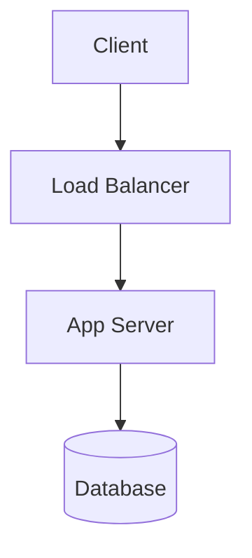

# UX Design: Mermaid Diagram Rendering

Grounded in `project_plans/mermaid-diagrams/requirements.md` and `research/ux.md`.
Component references verified against the current tree: `CodeFenceBlock.kt`
(`kmp/src/commonMain/kotlin/dev/stapler/stelekit/ui/components/CodeFenceBlock.kt`)
and its call site in `BlockItem.kt:372-377` (dispatch on `BlockTypes.CODE_FENCE`,
`language = codeFenceLanguage(block.content)`) and `BlockItem.kt:96-98`
(`BlockEditor`'s `textFieldValue` seeds from the **full** `block.content`,
including the ` ``` ` fence lines — confirms edit mode shows raw fenced source,
not just the body). `onStartEditing` is not a local state flip: it round-trips
`BlockList.kt:209-210` → `PageView.kt:291` / `JournalsView.kt:132` →
`BlockStateManager.requestEditBlock` (`BlockStateManager.kt:422`), which sets
`editingBlockUuid` and flows back down as `isEditing` on the next composition —
relevant because the diagram surface must trigger this exact same callback, not
a parallel edit-entry path.

Two concrete precedents ground the keyboard/accessibility requirements below,
identified by exploring the existing component tree rather than assumed:
- **Focusable, key-activatable non-text surface**: `SuggestionNavigatorPanel.kt:40-62`
  — `Modifier.focusRequester(focusRequester).focusable().onKeyEvent { ... }` mapping
  Enter and other keys to actions. `CodeFenceBlock` and its sibling block renderers
  (`ImageBlock`, `TableBlock`, etc.) are `clickable`-only today with no `focusable()`/
  `onKeyEvent` of their own — so the diagram surface needs this pattern added, it
  cannot assume `clickable` alone will preserve keyboard activation once a
  WebView/canvas is layered underneath it.
- **Semantics on a clickable block surface**: `ImageAnnotationBlockItem.kt:62-77`
  wraps its clickable thumbnail in `Modifier.semantics { contentDescription = "...";
  role = Role.Button }.clickable { ... }` — the direct precedent for how the
  diagram surface should expose `contentDescription` + `Role.Button`.

## Surfaces identified

Interactive (full treatment below):
1. **Mermaid block — view mode**, two visual states sharing one clickable/focusable
   frame: **rendered diagram** (success) and **raw fallback** (the one visual reused
   for loading, render failure, and unsupported platform, per research/ux.md's
   recommendation).
2. **View ↔ edit transition** — reuses the existing `BlockEditor` raw-text surface
   unchanged; documented here as a state machine because this project's only new
   requirement on it is keyboard reachability into and out of the diagram state.

Non-interactive (condensed entries):
3. Mermaid `accTitle`/`accDescr` authoring convention (source-level, not a SteleKit UI).
4. Per-platform render-capability behavior (silent capability gate, no user-facing toggle).

No other new screens, modals, or menus are introduced — this feature extends one
existing extension point (`CODE_FENCE` dispatch) and adds no navigation, settings,
or dialogs.

---

## Surface 1: Mermaid block — view mode

### 1a. Rendered diagram (success state)

```
┌───────────────────────────────────────────────────────────┐
│ mermaid                                                    │ ← language label
│ ┌─────────────────────────────────────────────────────┐   │   (same style as
│ │                                                       │   │   CodeFenceBlock's
│ │     ┌────────┐        ┌─────────────┐                 │   │   existing label,
│ │     │ Start  │ ─────▶ │  Decision?  │                 │   │   CodeFenceBlock.kt:53-59)
│ │     └────────┘        └──────┬──────┘                 │   │
│ │                               │ Yes                    │   │
│ │                               ▼                        │   │
│ │                          ┌────────┐                    │   │
│ │                          │  End   │                    │   │
│ │                          └────────┘                    │   │
│ └─────────────────────────────────────────────────────┘   │
└───────────────────────────────────────────────────────────┘
  ▲ rounded surfaceVariant chrome, identical to CodeFenceBlock's Box/clip/background
  ▲ whole card is one focus/click target — no separate "Edit" button, no icon overlay
```

### 1b. Raw fallback (loading / render failure / unsupported platform — one visual)

```
┌───────────────────────────────────────────────────────────┐
│ mermaid                                                    │
│ graph TD                                                    │
│   A[Start] --> B{Decision?}                                  │
│   B -->|Yes| C[End]                                          │
└───────────────────────────────────────────────────────────┘
  ▲ pixel-identical to today's CodeFenceBlock rendering of a ```mermaid fence —
    no spinner, no red error box, no "unsupported" badge
```

### Interaction flow

| Step | User action | System response |
|---|---|---|
| 1 | Page/block loads; block parsed as `CODE_FENCE` with `language = "mermaid"` | Raw fallback (1b) renders immediately — this **is** the loading state; nothing else shows first |
| 2 | Renderer (WebView/JS-engine/native, per-platform) attempts render, off the recomposition path | On success: surface swaps in place to 1a, preserving scroll position and focus if the block was focused. On failure or unsupported platform: surface stays at 1b — no transition is visible to the user |
| 3 | User clicks/taps anywhere on the card (1a or 1b) | `onStartEditing()` fires — identical call signature/behavior to `CodeFenceBlock`'s existing `.clickable { onStartEditing() }` |
| 4 | User tabs to the block via keyboard, then presses **Enter** or **Space** | Same `onStartEditing()` fires — see Surface 2 for the focus requirement this depends on |
| 5 | (1a only) User hovers/inspects with a screen reader | Reads the mermaid-supplied `accTitle`/`accDescr` text if present (see Surface 3), else a generic fallback label |

### Error / edge-case handling

| Case | What the user sees | Notes |
|---|---|---|
| Empty ` ```mermaid ` body | Raw fallback (1b), rendering an empty code block | Renderer is never invoked on empty source — cheapest correct behavior, matches `CodeFenceBlock`'s existing empty-body handling |
| Mermaid syntax error | Raw fallback (1b) — mermaid.js's own default red "Syntax error in text" box must be suppressed at the integration layer before it reaches the Compose tree | No SteleKit-authored error banner either — the raw block *is* the error state, same discovery loop as any other fenced-code typo |
| Diagram exceeds a size/complexity cap (2,000 characters — GitLab's block-size precedent; see plan.md Task 1.2.1a) | Raw fallback (1b), no dialog or toast | Prevents a pathological diagram from hanging a WebView indefinitely |
| Platform has no v1 renderer (iOS) | Raw fallback (1b) permanently — never attempts a render, never shows a "not supported on this device" message | Matches ADR-001's iOS-deferral precedent; a platform-capability message would be a dead end with no action for the user to take |
| Render takes noticeably longer than normal recomposition (WebView cold start) | Raw fallback (1b) persists with no spinner until success or the render is abandoned | A spinner is only added later if user testing shows the eventual raw→diagram swap reads as janky, per research/ux.md §4 |
| Render throws/crashes internally | Must be caught at the renderer-integration boundary and degrade to raw fallback (1b) — must **not** propagate into the block tree's recomposition | Correctness requirement underpinning the UX guarantee that a bad diagram never breaks the surrounding page |
| Focusable surface is a WebView/canvas that captures its own focus | Regression: keyboard Tab either skips the block or Enter/Space no longer reaches `onStartEditing()` | Explicit non-goal to avoid — see Surface 2 acceptance criteria |

---

## Surface 2: View ↔ edit transition (keyboard-reachability requirement on existing `BlockEditor`)

The edit surface itself (`BlockEditor`, `BlockItem.kt`'s `isEditing` branch) is
**unchanged** — this feature adds no new editor UI. What's new is a hard
requirement that reaching it must not depend on a mouse, because 1a's content is
a WebView/canvas render surface that can otherwise swallow focus and defeat the
keyboard path Compose's `clickable` gives every other block type for free.

```
 [1a: rendered diagram]  or  [1b: raw fallback]
            │
            │  click / tap  ──────────────┐
            │  Tab → focus, then          │
            │  Enter or Space  ───────────┤
            ▼                             ▼
                  onStartEditing()
                             │
                             ▼
        BlockItem flips isEditing = true (parent-owned state)
                             │
                             ▼
   BlockEditor replaces the view surface in place — TextFieldValue
   seeded from the FULL block.content, i.e. including the ```mermaid
   and closing ``` fence lines (BlockItem.kt:96-97) — cursor placed
   per the existing initialCursorPosition logic
                             │
        user edits raw source, then Esc / taps away / existing
        onStopEditing() triggers
                             ▼
        isEditing = false → content re-parsed → renderer re-invoked
        with the new source → back to Surface 1, step 1 (raw
        fallback shown first, diagram swapped in on success)
```

### Interaction flow

1. From either 1a or 1b, click/tap or (Tab + Enter/Space) calls `onStartEditing()`.
2. `BlockItem` swaps to `BlockEditor`, showing the raw markdown including fences —
   parity requirement from Acceptance Criterion 4 in requirements.md.
3. User edits text as they would any other code fence.
4. Existing `onStopEditing()` path exits edit mode; the new content is re-parsed,
   and Surface 1's flow restarts from step 1 (fallback-first, diagram on success).

### Error / edge-case handling

| Case | What the user sees | Exit path |
|---|---|---|
| WebView/canvas surface intercepts the click before it reaches the click handler | Nothing happens on click — dead end | Must not occur: the renderer wrapper composable must not consume pointer/focus events above the `clickable` modifier; verify no nested `pointerInput`/`clickable` inside the WebView host swallows the tap |
| Tab lands on the block but Enter/Space does nothing | Keyboard user cannot reach edit mode at all — the one legally-required dead end this design must eliminate | The diagram wrapper must add `Modifier.focusRequester(...).focusable().onKeyEvent { ... }` mapping Enter/Space to `onStartEditing()`, following the existing `SuggestionNavigatorPanel.kt:40-62` pattern — `clickable` alone is not enough once a WebView/canvas sits underneath, unlike plain-text block renderers where it is |
| User edits and introduces a new syntax error, then exits edit mode | Surface 1 shows raw fallback again (now displaying the *edited*, still-broken source) — no dialog interrupts the exit | Consistent with "errors never block continued writing" from research/ux.md §4 |

---

## Surface 3 (non-interactive): `accTitle`/`accDescr` authoring convention

Representative sample (author-supplied, inside the fence — no SteleKit UI):



Acceptance criteria:
- SteleKit's renderer wrapper does not strip the `<title>`/`<desc>` elements or
  `aria-roledescription` attribute that mermaid.js emits into the SVG from these
  directives — pass the SVG through unmodified.
- When `accTitle`/`accDescr` are absent, the rendered diagram surface (1a) still
  exposes a non-empty accessible label: `"Mermaid diagram — tap to view source"`.
- The raw fallback surface (1b) inherits `CodeFenceBlock`'s existing accessible
  behavior unchanged (no regression).
- No new SteleKit UI is introduced to author or edit `accTitle`/`accDescr` — this
  is a pass-through of an existing upstream mermaid.js convention.

## Surface 4 (non-interactive): per-platform render-capability gate

Representative behavior table (no dialog, no settings toggle — a silent capability check per platform):

| Platform | v1 behavior |
|---|---|
| JVM/Desktop | Attempts render (mechanism per ADR) |
| Web (JS) | Attempts render via `mermaid.js` directly |
| Android | Attempts render (WebView) |
| iOS | Always raw fallback (1b) — renderer never invoked |

Acceptance criteria:
- No toast, banner, or dialog ever tells the user "diagrams aren't supported on
  this device" — the raw fallback communicates this implicitly and non-disruptively.
- Platform capability is resolved once per app/session, not per block, so there is
  no per-block flicker between "checking support" and a final state.
- Behavior is identical for every mermaid block on an unsupported platform — no
  partial support (e.g., some diagram types rendering, others not) without it
  being called out as a distinct future surface.

---

## UX Acceptance Criteria

**Task completion**
1. User can go from a rendered diagram (or its raw fallback) to editing its raw
   source in **1 click/tap** or **1 keyboard action** (Tab-to-focus already
   satisfied by normal block navigation, then Enter/Space) — matching `CodeFenceBlock`'s
   existing 1-click parity exactly, per requirements.md Acceptance Criterion 4.
2. User can exit edit mode and see the diagram (or its fallback) re-render with
   **zero additional clicks** beyond the existing `onStopEditing()` trigger
   (Escape / tap away / existing block-navigation action) — no separate "render"
   or "preview" button is ever required.

**Error/fallback states**
3. A mermaid block with invalid syntax shows the exact same visual as a normal
   fenced code block (1b) — no red error box, no toast, no broken/blank view.
4. A mermaid block on a platform without v1 rendering support (e.g. iOS) shows
   1b indistinguishably from a syntax-error or loading case — a user cannot tell
   these three cases apart by looking, which is the intended, spec'd behavior.
5. No dead ends: every state (1a, 1b, edit mode) has at least one visible,
   discoverable exit — click/tap into edit, Escape/tap-away out of edit. No
   state requires the user to know an undocumented gesture or shortcut.
6. An empty ` ```mermaid ``` ` block never invokes the renderer and never shows
   a blank or crashed view — it shows fallback 1b rendering empty content.

**Consistency**
7. The rendered diagram (1a) and raw fallback (1b) use the same rounded-surface
   chrome, background color, padding, and language label placement as the
   existing `CodeFenceBlock` — verified by visual diff or shared-modifier reuse,
   not a parallel implementation.
8. Non-mermaid fenced code blocks are pixel-identical to their current rendering
   — this feature must not alter `CodeFenceBlock`'s existing behavior for any
   other language tag.

**Accessibility**
9. The diagram surface (1a) is reachable via Tab in the same position in tab
   order a plain code-fence block would occupy, and activates on both **Enter**
   and **Space** — implemented via `focusable()` + `onKeyEvent`, matching
   `SuggestionNavigatorPanel.kt:40-62`'s existing pattern — and verified by
   keyboard-only navigation through a page containing a mermaid block, with no
   mouse input at any point.
10. Every rendered diagram (1a) exposes a non-empty accessible name/description
    to assistive tech via `Modifier.semantics { contentDescription = ...; role =
    Role.Button }`, matching `ImageAnnotationBlockItem.kt:62-77`'s existing
    pattern: the mermaid-authored `accTitle`/`accDescr` when present, else the
    generic fallback string specified in Surface 3.
11. The WebView/canvas/JS-engine host used to render the diagram does not trap
    focus — verified by tabbing from the block above the diagram, through the
    diagram, to the block below, with no focus loss or double-tab-stop.
12. Color contrast of all text SteleKit itself renders around the diagram (the
    `mermaid` language label, and all raw-fallback text) meets WCAG AA (4.5:1)
    — inherited unchanged from `CodeFenceBlock`'s existing `onSurfaceVariant`
    color usage, not a new color introduced by this feature.
13. Screen-reader users are never presented with mermaid's own low-quality
    default fallback (a flat, unlabeled list of node text) — SteleKit's injected
    generic label (Surface 3) takes precedence whenever `accTitle`/`accDescr`
    are absent.

**Stability**
14. A render failure inside the mermaid renderer is caught at the integration
    boundary and never propagates an exception into the block tree's
    recomposition — verified by a test page containing a deliberately malformed
    mermaid block alongside normal editable blocks, confirming the rest of the
    page remains fully interactive.
15. Repeated recomposition of an unchanged diagram (e.g., scrolling the page)
    does not re-trigger a visible raw-fallback → diagram flicker — the
    rendered/cached result is stable across recompositions of the same source.

---

## Summary

- **4 surfaces designed**: 2 interactive (mermaid block view-mode with 2 visual
  states; view↔edit transition), 2 non-interactive/condensed (`accTitle`/`accDescr`
  authoring convention; per-platform capability gate).
- **15 UX acceptance criteria** written, covering task completion, error/fallback
  states, visual consistency, accessibility, and rendering stability.
